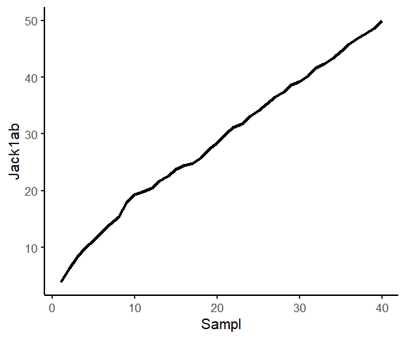
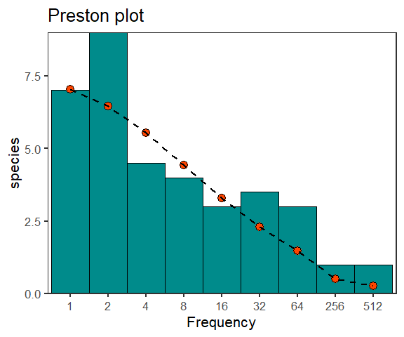
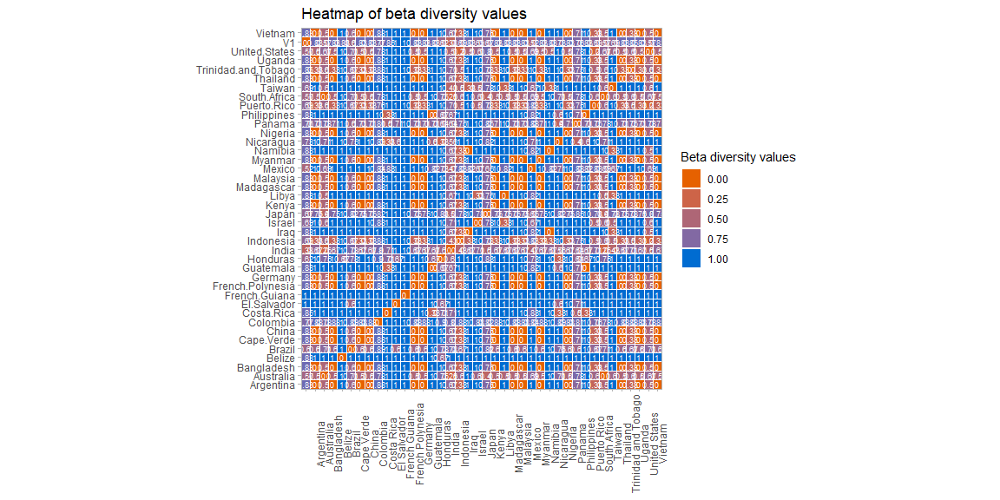

<!-- README.md is generated from README.Rmd. Please edit that file -->

# BOLDconnectR

<!-- badges: start -->
<!-- badges: end -->

BOLDconnectR is a package designed for **retrieval**, **transformation**
and **analysis** of the data available in the *Barcode Of Life Data
Systems (BOLD)* database. This package provides the functionality to
obtain public and private user data available in the database in the
*Barcode Core Data Model (BCDM)* format. Data include information on the
**taxonomy**,**geography**,**collection**,**identification** and **DNA
sequence** of every submission.

## Installing BOLDConnectR

The package can be installed using `devtools::install_github` function
from the `devtools` package in R (which needs to be installed before
installing BOLDConnectR). *This package currently exists as a private
repo and thus has an authorization token*.

    #> Downloading GitHub repo sameerpadhye/BOLDconnectR@HEAD
    #> digest (0.6.36 -> 0.6.37) [CRAN]
    #> Installing 1 packages: digest
    #> Installing package into 'C:/Users/samee/AppData/Local/R/win-library/4.4'
    #> (as 'lib' is unspecified)
    #> Warning: unable to access index for repository https://bioconductor.org/packages/3.18/bioc/bin/windows/contrib/4.4:
    #>   cannot open URL 'https://bioconductor.org/packages/3.18/bioc/bin/windows/contrib/4.4/PACKAGES'
    #> Warning: unable to access index for repository https://bioconductor.org/packages/3.18/data/annotation/bin/windows/contrib/4.4:
    #>   cannot open URL 'https://bioconductor.org/packages/3.18/data/annotation/bin/windows/contrib/4.4/PACKAGES'
    #> Warning: unable to access index for repository https://bioconductor.org/packages/3.18/data/experiment/bin/windows/contrib/4.4:
    #>   cannot open URL 'https://bioconductor.org/packages/3.18/data/experiment/bin/windows/contrib/4.4/PACKAGES'
    #> Warning: unable to access index for repository https://bioconductor.org/packages/3.18/workflows/bin/windows/contrib/4.4:
    #>   cannot open URL 'https://bioconductor.org/packages/3.18/workflows/bin/windows/contrib/4.4/PACKAGES'
    #> Warning: unable to access index for repository https://bioconductor.org/packages/3.18/books/bin/windows/contrib/4.4:
    #>   cannot open URL 'https://bioconductor.org/packages/3.18/books/bin/windows/contrib/4.4/PACKAGES'
    #> package 'digest' successfully unpacked and MD5 sums checked
    #> Warning: cannot remove prior installation of package 'digest'
    #> Warning in file.copy(savedcopy, lib, recursive = TRUE): problem copying
    #> C:\Users\samee\AppData\Local\R\win-library\4.4\00LOCK\digest\libs\x64\digest.dll
    #> to C:\Users\samee\AppData\Local\R\win-library\4.4\digest\libs\x64\digest.dll:
    #> Permission denied
    #> Warning: restored 'digest'
    #> 
    #> The downloaded binary packages are in
    #>  C:\Users\samee\AppData\Local\Temp\RtmpGyPySV\downloaded_packages
    #> ── R CMD build ─────────────────────────────────────────────────────────────────
    #>          checking for file 'C:\Users\samee\AppData\Local\Temp\RtmpGyPySV\remotes2cf45dbf5fc0\sameerpadhye-BOLDconnectR-c14a47ce5d4911c1de06beed5352c95928ac4eed/DESCRIPTION' ...  ✔  checking for file 'C:\Users\samee\AppData\Local\Temp\RtmpGyPySV\remotes2cf45dbf5fc0\sameerpadhye-BOLDconnectR-c14a47ce5d4911c1de06beed5352c95928ac4eed/DESCRIPTION'
    #>       ─  preparing 'BOLDconnectR': (624ms)
    #>    checking DESCRIPTION meta-information ...     checking DESCRIPTION meta-information ...   ✔  checking DESCRIPTION meta-information
    #>       ─  checking for LF line-endings in source and make files and shell scripts
    #>   ─  checking for empty or unneeded directories
    #>       ─  building 'BOLDconnectR_0.1.0.tar.gz'
    #>      
    #> 
    #> Installing package into 'C:/Users/samee/AppData/Local/R/win-library/4.4'
    #> (as 'lib' is unspecified)

## The package currently has 10 functions:

1.  bold.fields.info
2.  bold.connectr
3.  bold.connectr.public
4.  data.summary
5.  gen.comm.mat
6.  analyze.alphadiv
7.  analyze.betadiv
8.  visualize.geo
9.  *align.seq*
10. *analyze.seq*

*These functions are currently internal functions which require external
dependencies not included in the package. For their specific usage,
please see the details provided below.*

### Note on API key

The function `bold.connectr` requires an `api key` in order to access
and download all public + private user data. API key can be obtained by
emailing the BOLD support (<support@boldsystems.org>). API key is needed
only for the data retrieval and can be added directly within the
function. Alternatively, it can be set up as an environmental variable
using the ‘Sys.setenv’ function.

``` r
# The key can be added in place of "api.key" 
Sys.setenv ("api_key"="api.key")
```

It can then be retrieved using `Sys.getenv` function directly or by
storing it as another variable.

``` r
api.key <- Sys.getenv('api_key')
```

## Functions usage:

### 1.bold.fields.info:

`bold.fields.info` provides all the metadata related to the various
fields (columns) currently available for download from BOLD. The
function gives the name, definition and the data type of each field.

| field     | definition                                                                                              | R_field_types |
|:----------|:--------------------------------------------------------------------------------------------------------|:--------------|
| processid | BOLD System generated unique identifier for the sample being sequenced.                                 | character     |
| sampleid  | User generated identifier for the sample being sequenced, often identical to the Field ID or Museum ID. | character     |
| fieldid   | Specimen or sample identifier generated in the field or lot number for a bulk collection event.         | character     |
| museumid  | Catalog number from a museum collection.                                                                | character     |
| record_id | A BOLD generated identifier for the marker and specimen sequence combination.                           | character     |

### 2.bold.connectr:

This function retrieves public and private user data on BOLD using
the`api key`.The downloaded data can also be filtered using the various
filter arguments available (all arguments after the `api_key`). The
filtering happens locally after the data is downloaded. Care has to be
taken to select the filters properly. If wrong/too many filters are
applied, it can result in an empty result. The `fields` argument in the
function helps in selecting only the fields needed by the user.

Test data Test data is a data frame having 2 columns and 2100 unique
ids. First column has ‘processids’ while second has ‘sampleids’. Either
one can be used to retrieve data from BOLD.

``` r

knitr::kable(head(test.data,5))
```

| processid  | sampleid |
|:-----------|:---------|
| ACAM001-13 | AC13A01  |
| ACAM008-13 | AC13A14  |
| ACAM015-13 | AC13A32  |
| ACAM027-13 | AC13A72  |
| ACAM030-13 | AC13A78  |

### 2a.Default (all data retrieved)

The arguments provided below need to be specified by default for every
request. Default settings retrieve data for all available fields for
those ids. Certain ids might not have information for certain fields in
which case the number of columns could be different

``` r
api.key <- Sys.getenv('api_key')
# A small subset of the data used for data retrieval
to_download=test.data[1:100,]

result<-bold.connectr(input.data = to_download,
                                  param = 'processid',
                                  param.index = 1,
                                  api_key = api.key)
knitr::kable(head(result,5))
```

| processid | record_id        | insdc_acs | sampleid    | specimenid | taxid | short_note | identification_method | museumid | fieldid     | collection_code | processid_minted_date | inst               | specimendetails.verbatim_depository | funding_src | sex | life_stage | reproduction | habitat | collectors | site_code | specimen_linkout | collection_event_id | sampling_protocol | tissue_type | collection_date_start | specimendetails.verbatim_collectiondate | collection_time | collection_date_accuracy | specimendetails.verbatim_collectiondate_precision | associated_taxa | associated_specimens | voucher_type | notes | taxonomy_notes | collection_notes | specimendetails.verbatim_kingdom | specimendetails.verbatim_phylum | specimendetails.verbatim_class | specimendetails.verbatim_order | specimendetails.verbatim_family | specimendetails.verbatim_subfamily | specimendetails.verbatim_tribe | specimendetails.verbatim_genus | specimendetails.verbatim_species | specimendetails.verbatim_subspecies | specimendetails.verbatim_species_reference | specimendetails.verbatim_identifier | geoid | location.verbatim_country | location.verbatim_province | location.verbatim_country_iso_alpha3 | marker_code | kingdom  | phylum   | class          | order        | family    | subfamily           | tribe | genus       | species               | subspecies | identification        | identification_rank | tax_rank.numerical_posit | species_reference | identified_by | specimendetails\_\_identifier.person.email | sequence_run_site  | nuc                                                                                                                                                                                                                                                                                                                                                                                                                                                                                                                                                                                                                                                                              | nuc_basecount | sequence_upload_date | bin_uri      | bin_created_date | elev | location.verbatim_elev | depth | location.verbatim_depth | lat | lon | location.verbatim_coord | coord_source | coord_accuracy | location.verbatim_gps_accuracy | elev_accuracy | location.verbatim_elev_accuracy | depth_accuracy | location.verbatim_depth_accuracy | realm | biome | ecoregion | region | sector | site | country_iso | country.ocean | province.state | bold_recordset_code_arr            | geopol_denorm.country_iso3 | collection_date_end |
|:----------|:-----------------|:----------|:------------|-----------:|------:|:-----------|:----------------------|:---------|:------------|:----------------|:----------------------|:-------------------|:------------------------------------|:------------|:----|:-----------|:-------------|:--------|:-----------|:----------|:-----------------|:--------------------|:------------------|:------------|:----------------------|:----------------------------------------|:----------------|:-------------------------|:--------------------------------------------------|:----------------|:---------------------|:-------------|:------|:---------------|:-----------------|:---------------------------------|:--------------------------------|:-------------------------------|:-------------------------------|:--------------------------------|:-----------------------------------|:-------------------------------|:-------------------------------|:---------------------------------|:------------------------------------|:-------------------------------------------|:------------------------------------|------:|:--------------------------|:---------------------------|:-------------------------------------|:------------|:---------|:---------|:---------------|:-------------|:----------|:--------------------|:------|:------------|:----------------------|:-----------|:----------------------|:--------------------|-------------------------:|:------------------|:--------------|:-------------------------------------------|:-------------------|:---------------------------------------------------------------------------------------------------------------------------------------------------------------------------------------------------------------------------------------------------------------------------------------------------------------------------------------------------------------------------------------------------------------------------------------------------------------------------------------------------------------------------------------------------------------------------------------------------------------------------------------------------------------------------------|--------------:|:---------------------|:-------------|:-----------------|-----:|:-----------------------|------:|:------------------------|----:|----:|:------------------------|:-------------|---------------:|:-------------------------------|--------------:|:--------------------------------|---------------:|:---------------------------------|:------|:------|:----------|:-------|:-------|:-----|:------------|:--------------|:---------------|:-----------------------------------|:---------------------------|:--------------------|
| AJS107-19 | AJS107-19.COI-5P |           | S-03-A-FBC7 |   10597473 | 52768 | NA         | NA                    |          | S-03-A-FBC7 |                 | 2019-08-08            | Chapman University | NA                                  | NA          | NA  | NA         | NA           | NA      |            | NA        | NA               | NA                  | NA                | NA          | NA                    | NA                                      | NA              | NA                       | NA                                                | NA              | NA                   | NA           | NA    | NA             | NA               | NA                               | NA                              | NA                             | NA                             | NA                              | NA                                 | NA                             | NA                             | NA                               | NA                                  | NA                                         | NA                                  |   238 | NA                        | NA                         | NA                                   | COI-5P      | Animalia | Chordata | Actinopterygii | Cichliformes | Cichlidae | Pseudocrenilabrinae | NA    | Oreochromis | Oreochromis niloticus | NA         | Oreochromis niloticus | species             |                       17 | Linnaeus, 1758    | NA            | NA                                         | Chapman University | CCTCTATCTAGTATTTGGTGCTTGAGCCGGAATAGTAGGAACTGCACTAAGCCTCCTAATTCGGGCAGAACTAAGCCAGCCCGGCTCTCTTCTCGGAGACGACCAAATCTATAATGTAATTGTTACAGCACATGCTTTCGTAATAATTTTCTTTATAGTAATACCAATTATGATTGGAGGCTTTGGAAACTGACTAGTACCCCTCATGATTGGTGCACCAGACATGGCCTTCCCTCGAATAAATAACATGAGCTTTTGACTTCTCCCCCCCTCATTTCTTCTTCTTCTCGCCTCATCTGGAGTCGAAGCAGGTGCCGGCACAGGTTGGACTGTTTATCCCCCGCTCGCAGGCAATCTTGCCCACGCTGGACCTTCTGTTGACTTAACCATCTTCTCCCTCCACTTGGCCGGAGTGTCATCTATTTTAGGTGCAATTAATTTTATCACAACCATTATTAACATGAAGCCCCCTGCCATCTCCCAATATCAAACACCCCTATTTGTGTGATCCGTCCTAATTACCGCAGTACTACTCCTTCTATCCCTGCCCGTTCTTGCCGCCGGCATCACAATACTTCTAACAGACCGAAACCTAAACACAACCTTCTTTGACCCTGCCGGAGGAGGAGACCCCATCCTATACCAACACTTATTC- |           655 | 2019-08-09           | BOLD:AAC9904 | 2010-07-15       |   NA | NA                     |    NA | NA                      |  NA |  NA | NA                      | NA           |             NA | NA                             |            NA | NA                              |             NA | NA                               | NA    | NA    | NA        | NA     | NA     | NA   | US          | United States |                | AJS,DS-OREOSA,DS-OREOSARO,DS-CICHI | USA                        | NA                  |
| AJS009-19 | AJS009-19.COI-5P |           | S-03-C-FB   |   10597375 | 52768 | NA         | NA                    |          | S-03-C-FB   |                 | 2019-08-08            | Chapman University | NA                                  | NA          | NA  | NA         | NA           | NA      |            | NA        | NA               | NA                  | NA                | NA          | NA                    | NA                                      | NA              | NA                       | NA                                                | NA              | NA                   | NA           | NA    | NA             | NA               | NA                               | NA                              | NA                             | NA                             | NA                              | NA                                 | NA                             | NA                             | NA                               | NA                                  | NA                                         | NA                                  |   238 | NA                        | NA                         | NA                                   | COI-5P      | Animalia | Chordata | Actinopterygii | Cichliformes | Cichlidae | Pseudocrenilabrinae | NA    | Oreochromis | Oreochromis niloticus | NA         | Oreochromis niloticus | species             |                       17 | Linnaeus, 1758    | NA            | NA                                         | Chapman University | ————-TATCTAGTATTTGGTGCTTGAGCCGGAATAGTAGGAACWGCACTAAGCCTCCTAATTCGGGCAGAAGTAAGCCAGCCCGGCTCTCTTCTCGGAGACGACCAAATYTATAATGTAATTGTTACAGCACATGCTTTCGTAATAATTTTCTTTATAGTAATACCAATTATGATTGGAGGCTTTGGAAACTGA——————————————————————————————————————————————————-TCGCAGGCAATCTTGCCCACGCTGGACCTTCTGTTGACTTAACCATCTTCTCCCTCCACTTGGCCGGARTGTCATCTATTTTAGGTGCAATTAATTTTATCACAACCATTATTAACATGAAACCCCCTGCCATCTCCCAATATCAAACACCCCTATTTG—————————————————————————————————————————————————————-                                                                                                                                                                                                       |           345 | 2019-08-08           | NA           | NA               |   NA | NA                     |    NA | NA                      |  NA |  NA | NA                      | NA           |             NA | NA                             |            NA | NA                              |             NA | NA                               | NA    | NA    | NA        | NA     | NA     | NA   | US          | United States |                | AJS,DS-OREOSA,DS-OREOSARO,DS-CICHI | USA                        | NA                  |
| AJS084-19 | AJS084-19.COI-5P |           | S-13-C-MB   |   10597450 | 52768 | NA         | NA                    |          | S-13-C-MB   |                 | 2019-08-08            | Chapman University | NA                                  | NA          | NA  | NA         | NA           | NA      |            | NA        | NA               | NA                  | NA                | NA          | NA                    | NA                                      | NA              | NA                       | NA                                                | NA              | NA                   | NA           | NA    | NA             | NA               | NA                               | NA                              | NA                             | NA                             | NA                              | NA                                 | NA                             | NA                             | NA                               | NA                                  | NA                                         | NA                                  |   238 | NA                        | NA                         | NA                                   | COI-5P      | Animalia | Chordata | Actinopterygii | Cichliformes | Cichlidae | Pseudocrenilabrinae | NA    | Oreochromis | Oreochromis niloticus | NA         | Oreochromis niloticus | species             |                       17 | Linnaeus, 1758    | NA            | NA                                         | Chapman University | CGACGTTGTAAAACGACACYAAGCAYAAAGAYATGGGCACCCTCTATCTAGTATTTGGTGCTTGAGCCGGAATAGTAGGAACTGCACTAAGCCTCCTAATTCGGGCAGAACTAAGCCAGCCCGGCTCTCTTCTCGGAGACGACCAAATCTATAATGTAATTGTTACAGCACATGCTTTCGTAATAATTTTCTTTATAGTAATACCAATTATGATTGGAGGCTTTGGAAACTGACTAGTACCCCTCATGATTGGTGCACCAGACATGGCCTT                                                                                                                                                                                                                                                                                                                                                                                                  |           268 | 2019-08-08           | NA           | NA               |   NA | NA                     |    NA | NA                      |  NA |  NA | NA                      | NA           |             NA | NA                             |            NA | NA                              |             NA | NA                               | NA    | NA    | NA        | NA     | NA     | NA   | US          | United States |                | AJS,DS-OREOSA,DS-OREOSARO          | USA                        | NA                  |
| AJS022-19 | AJS022-19.COI-5P |           | S-08-A-FB   |   10597388 | 52768 | NA         | NA                    |          | S-08-A-FB   |                 | 2019-08-08            | Chapman University | NA                                  | NA          | NA  | NA         | NA           | NA      |            | NA        | NA               | NA                  | NA                | NA          | NA                    | NA                                      | NA              | NA                       | NA                                                | NA              | NA                   | NA           | NA    | NA             | NA               | NA                               | NA                              | NA                             | NA                             | NA                              | NA                                 | NA                             | NA                             | NA                               | NA                                  | NA                                         | NA                                  |   238 | NA                        | NA                         | NA                                   | COI-5P      | Animalia | Chordata | Actinopterygii | Cichliformes | Cichlidae | Pseudocrenilabrinae | NA    | Oreochromis | Oreochromis niloticus | NA         | Oreochromis niloticus | species             |                       17 | Linnaeus, 1758    | NA            | NA                                         | Chapman University | ———————–TTGGTGCTTGAGCCGGAATAGTAGGAACTGCMCTAAGCCTCCTAATTCGGGCAGAACTAAGYCARCCYGGYKCTCTYCTCGGAGACGAYCAAATYTATAATGTAATTGTTACAGCACATGCTTTCGTAATAATTTTCTTTATAGTAATACCAATWATRATTGGAGGCTTTGGAAACTGACTARTACCYCTCATGATYGGTGCMCCMGAYATGGCYTTCCCTCGAATAAATAACATRAGCTTYTGACTTCTCCCCCCCTCWTTTCTGCTTCTTYTMGCMTCMTCTGGAGTCGAAGC——————————————————————————————————————————————————————————————————————————————————————————————————————————————————————                                                                                                                                                                                                                                            |           270 | 2019-08-08           | NA           | NA               |   NA | NA                     |    NA | NA                      |  NA |  NA | NA                      | NA           |             NA | NA                             |            NA | NA                              |             NA | NA                               | NA    | NA    | NA        | NA     | NA     | NA   | US          | United States |                | AJS,DS-OREOSA,DS-OREOSARO          | USA                        | NA                  |
| AJS079-19 | AJS079-19.COI-5P |           | S-12-A-MB   |   10597445 | 52768 | NA         | NA                    |          | S-12-A-MB   |                 | 2019-08-08            | Chapman University | NA                                  | NA          | NA  | NA         | NA           | NA      |            | NA        | NA               | NA                  | NA                | NA          | NA                    | NA                                      | NA              | NA                       | NA                                                | NA              | NA                   | NA           | NA    | NA             | NA               | NA                               | NA                              | NA                             | NA                             | NA                              | NA                                 | NA                             | NA                             | NA                               | NA                                  | NA                                         | NA                                  |   238 | NA                        | NA                         | NA                                   | COI-5P      | Animalia | Chordata | Actinopterygii | Cichliformes | Cichlidae | Pseudocrenilabrinae | NA    | Oreochromis | Oreochromis niloticus | NA         | Oreochromis niloticus | species             |                       17 | Linnaeus, 1758    | NA            | NA                                         | Chapman University | CAAATYTATAATGTAATTGTTACAGCRCATGCTTTCGTAATAATTTTCTTTATAGTAATACCAATWATRATTGGAGGCTTTGGAAACTGACTMRTWCCYCTCATGATYGGTGCMCC                                                                                                                                                                                                                                                                                                                                                                                                                                                                                                                                                             |           106 | 2019-08-08           | NA           | NA               |   NA | NA                     |    NA | NA                      |  NA |  NA | NA                      | NA           |             NA | NA                             |            NA | NA                              |             NA | NA                               | NA    | NA    | NA        | NA     | NA     | NA   | US          | United States |                | AJS,DS-OREOSA,DS-OREOSARO          | USA                        | NA                  |

### 2b.Institutes Filter

Data is downloaded followed by the ‘institute’ filter applied on it to
fetch only the relevant ‘institute’ (here South African Institute for
Aquatic Biodiversity) data.

``` r
api.key <- Sys.getenv('api_key')
# A small subset of the data used for data retrieval
result_institutes<-bold.connectr(input.data = to_download,
                                  param = 'processid',
                                  param.index = 1,
                                  api_key = api.key,
                      institutes = "South African Institute for Aquatic Biodiversity",
                      fields = c("bin_uri","processid","inst"))

knitr::kable(head(result_institutes,5))
```

| processid  | sampleid | bin_uri      | inst                                             |
|:-----------|:---------|:-------------|:-------------------------------------------------|
| ACAM015-13 | AC13A32  | BOLD:AAA8511 | South African Institute for Aquatic Biodiversity |
| ACAM030-13 | AC13A78  | BOLD:AAA8511 | South African Institute for Aquatic Biodiversity |
| ACAM008-13 | AC13A14  | BOLD:ACE5030 | South African Institute for Aquatic Biodiversity |
| ACAM001-13 | AC13A01  | BOLD:AAA8511 | South African Institute for Aquatic Biodiversity |
| ACAM073-13 | AC13A103 | BOLD:AAA8511 | South African Institute for Aquatic Biodiversity |

### 2c.Geographic location filter

Data is downloaded followed by the ‘geography’ filter applied on it to
fetch only the relevant locations (here Ciudad de Mexico,Antioquia
Colorado) data.

``` r
api.key <- Sys.getenv('api_key')

to_download=test.data[1:100,]
result_geography<-bold.connectr(input.data = to_download,
                                  param = 'processid',
                                  param.index = 1,
                                  api_key = api.key,
                                 geography=c("United States"),
                                fields = c("bin_uri","processid","province.state"))
 
knitr::kable(head(result_geography,5))                 
```

| processid | sampleid    | bin_uri      | province.state |
|:----------|:------------|:-------------|:---------------|
| AJS107-19 | S-03-A-FBC7 | BOLD:AAC9904 |                |
| AJS009-19 | S-03-C-FB   | NA           |                |
| AJS084-19 | S-13-C-MB   | NA           |                |
| AJS022-19 | S-08-A-FB   | NA           |                |
| AJS079-19 | S-12-A-MB   | NA           |                |

### 2d.Altitude

Data is downloaded followed by the ‘Altitude’ filter applied on it to
fetch data only between the range of altitude specified (100 to 1500 m
a.s.l.) data.

``` r
api.key <- Sys.getenv('api_key')

result_altitude<-bold.connectr(input.data = test.data,
                                  param = 'processid',
                                  param.index = 1,
                                  api_key = api.key,
                                 altitude = c(100,1500),
                               fields = c("bin_uri","processid","family","elev"))

knitr::kable(head(result_altitude,5))                    
```

| processid  | sampleid | bin_uri      | family    | elev |
|:-----------|:---------|:-------------|:----------|-----:|
| ACAM027-13 | AC13A72  | BOLD:AAA8511 | Cichlidae |  496 |
| ACAM001-13 | AC13A01  | BOLD:AAA8511 | Cichlidae |  532 |
| ACAM015-13 | AC13A32  | BOLD:AAA8511 | Cichlidae |  526 |
| ACAM008-13 | AC13A14  | BOLD:ACE5030 | Cichlidae |  501 |
| ACAM030-13 | AC13A78  | BOLD:AAA8511 | Cichlidae |  286 |

### 2e.Collection period

Data is downloaded followed by the ‘Collection period’ filter applied on
it to fetch data only between the range of dates specified (2009-2010)
data.

``` r
api.key <- Sys.getenv('api_key')
result_collection.per<-bold.connectr(input.data = test.data,
                                  param = 'processid',
                                  param.index = 1,
                                  api_key = api.key,
                                 collection.period = c( "1995-05-26","2010-01-13"),
                                 fields=c("bin_uri","processid","collection_date_start","collection_date_end"))

knitr::kable(head(result_collection.per,5))
```

| processid     | sampleid | bin_uri      | collection_date_start | collection_date_end |
|:--------------|:---------|:-------------|:----------------------|:--------------------|
| GBGCA11620-15 | KJ669572 | BOLD:AAA8511 | 2009-07-15            | 2010-01-13          |
| GBGCA11628-15 | KJ669573 | BOLD:AAA6537 | 2009-07-15            | 2010-01-13          |

### 3.bold.connectr.public

This function retrieves all the public available data based on the
query. NO `api key` is required for this function. It also differs from
`bold.connectr` with respect to the way the data is fetched. Search can
be based on Taxonomic names, geographical locations in addition to ids
(processid and sampleid) and BINs (BIN numbers). All the other filters
can then be used on the downloaded data to refine the result. *The
search parameters of `bold.connectr.public` should be used carefully if
a filtered result (like above) is expected. Wrong combination of
parameters might not retrieve any data.*

### 3a. All data retrieved based on taxonomy

``` r

result.public<-bold.connectr.public(taxonomy = c("Panthera leo"),fields = c("bin_uri","processid","genus","species"))
#> Warning in bold.connectr.public(taxonomy = c("Panthera leo"), fields =
#> c("bin_uri", : The combination of any of the taxonomy, geography, bins, ids and
#> datasets inputs should be logical otherwise output obtained might either be
#> empty or not correct

knitr::kable(head(result.public,10))                    
```

| processid    | sampleid     | bin_uri      | genus    | species      |
|:-------------|:-------------|:-------------|:---------|:-------------|
| ABRMM002-06  | ROM PM13004  | BOLD:AAD6819 | Panthera | Panthera leo |
| ABRMM043-06  | ROM 101200   | BOLD:AAD6819 | Panthera | Panthera leo |
| CAR055-11    | Ple153       |              | Panthera | Panthera leo |
| CAR055-11    | Ple153       |              | Panthera | Panthera leo |
| CAR056-11    | Ple185       |              | Panthera | Panthera leo |
| CAR056-11    | Ple185       |              | Panthera | Panthera leo |
| GBCHO2596-23 | XR_006196888 |              | Panthera | Panthera leo |
| GBCHO2597-23 | XR_006196890 |              | Panthera | Panthera leo |
| GBCHO2598-23 | XR_006196891 |              | Panthera | Panthera leo |
| GBCHO2599-23 | XR_006196892 |              | Panthera | Panthera leo |

### 3b.All data retrieved based on taxonomy and geography

``` r
result.public.geo<-bold.connectr.public(taxonomy = c("Panthera leo"),geography = "India",fields = c("bin_uri","processid","country.ocean","genus","species"))
#> Warning in bold.connectr.public(taxonomy = c("Panthera leo"), geography =
#> "India", : The combination of any of the taxonomy, geography, bins, ids and
#> datasets inputs should be logical otherwise output obtained might either be
#> empty or not correct

knitr::kable(head(result.public.geo,5))                    
```

| processid  | sampleid        | bin_uri      | country.ocean | genus    | species      |
|:-----------|:----------------|:-------------|:--------------|:---------|:-------------|
| CAR056-11  | Ple185          |              | India         | Panthera | Panthera leo |
| CAR056-11  | Ple185          |              | India         | Panthera | Panthera leo |
| GENG056-12 | BIOMTWL-BLE-017 | BOLD:AAD6819 | India         | Panthera | Panthera leo |
| GENG057-12 | BIOMTWL-BLE-063 |              | India         | Panthera | Panthera leo |
| GENG105-12 | BIOMTWL-BLE-043 |              | India         | Panthera | Panthera leo |

### 3c.All data retrieved based on taxonomy, geography and BIN id

``` r
result.public.geo.bin<-bold.connectr.public(taxonomy = c("Panthera leo"),geography = "India",bins = 'BOLD:AAD6819',fields = c("bin_uri","country.ocean","genus","species"))
#> Warning in bold.connectr.public(taxonomy = c("Panthera leo"), geography =
#> "India", : The combination of any of the taxonomy, geography, bins, ids and
#> datasets inputs should be logical otherwise output obtained might either be
#> empty or not correct
 
knitr::kable(head(result.public.geo.bin))                   
```

| processid  | sampleid        | bin_uri      | country.ocean | genus    | species      |
|:-----------|:----------------|:-------------|:--------------|:---------|:-------------|
| GENG056-12 | BIOMTWL-BLE-017 | BOLD:AAD6819 | India         | Panthera | Panthera leo |

### 4.data.summary

`data.summary` provides a detailed profile of the data downloaded
through `bold.connectr` or `bold.connectr.public`. This profile is
further broken by data types wherein each type of data get some unique
measures (Ex.mean,mode for numeric data). Profile can also be created
for specific columns using the `columns` argument. The function also
prints the number of rows and columns in the console by default.

``` r
result.public.geo.bin<-bold.connectr.public(taxonomy = c("Mus musculus"),fields = c("bin_uri","country.ocean","genus","species"))
#> Warning in bold.connectr.public(taxonomy = c("Mus musculus"), fields =
#> c("bin_uri", : The combination of any of the taxonomy, geography, bins, ids and
#> datasets inputs should be logical otherwise output obtained might either be
#> empty or not correct
                    
data.summ.res<-data.summary(result.public.geo.bin)
#> The total number of rows in the dataset is: 625 
#> The total number of columns in the dataset is: 6

data.summ.res
```

**Variable type: character**

| skim_variable | n_missing | complete_rate | min | max | empty | n_unique | whitespace |
|:--------------|----------:|--------------:|----:|----:|------:|---------:|-----------:|
| processid     |         0 |             1 |   9 |  13 |     0 |      549 |          0 |
| sampleid      |         0 |             1 |   3 |  21 |     0 |      548 |          0 |
| bin_uri       |         0 |             1 |   0 |  12 |    88 |       12 |          0 |
| country.ocean |         0 |             1 |   0 |  19 |   265 |       38 |          0 |
| genus         |         0 |             1 |   3 |   3 |     0 |        1 |          0 |
| species       |         0 |             1 |  12 |  12 |     0 |        1 |          0 |

### 5.gen.comm.mat

`gen.comm.mat`transforms the `bold.connectr()` or
`bold.connectr.public()` downloaded data into a **site X species** like
matrix. Instead of species counts (or abundances) though, values in each
cell are the counts (or abundances) BINs from the site category
(*site.cat*) or a *grid*. These counts can be generated at any taxonomic
hierarchical level for a single or multiple taxa (This can also be done
for ‘bin_uri’; the difference being that the numbers in each cell would
be the number of times that respective BIN is found at a particular
*site.cat* or *grid*). *site.cat* can be any of the geography fields
(Meta data on fields can be checked using the `bold.fields.info()`).
Alternatively, `grids` = TRUE will generate grids based on the BIN
occurrence data (latitude, longitude) with the size of the grid
determined by the user (in sq.m.). For grids generation, rows with no
latitude and longitude data are removed (even if a corresponding
*site.cat* information is available) while NULL entries for *site.cat*
are allowed if they have a latitude and longitude value (This is done
because grids are drawn based on the bounding boxes which only use
latitude and longitude values).grids converts the Coordinate Reference
System (CRS) of the data to a **Mollweide** projection by which distance
based grid can be appropriately specified. A cell id is also given to
each grid with the smallest number assigned to the lowest latitudinal
point in the data. The cell ids can be changed as per the user by making
changes in the `grids_final` `sf` data frame stored in the output. The
grids can be visualized with `view.grids`=TRUE. The plot obtained is a
visualization of the grid centroids with their respective names. *Please
note that if the data has many closely located grids, visualization with
view.grids can get confusing*. The argument `pre.abs` will convert the
counts (or abundances) to 1 and 0. This data set can then directly be
used as the input data for functions from packages like vegan for
biodiversity analyses.

|        | Panthera.leo | Panthera.onca | Panthera.pardus | Panthera.tigris | Panthera.uncia |
|:-------|-------------:|--------------:|----------------:|----------------:|---------------:|
| cell_1 |            4 |            14 |              11 |               4 |              0 |
| cell_2 |           13 |             0 |              61 |              46 |              3 |
| cell_3 |            0 |             0 |               1 |               0 |              0 |
| cell_4 |            1 |             0 |               0 |               2 |              0 |
| cell_5 |            1 |             0 |               1 |               0 |              0 |

### 6.analyze.alphadiv

``` r

# Download data from BOLD (removing species with blanks)
comm.mat.data<-bold.connectr.public(taxonomy = "Poecilia")

# Remove rows which have no species data
comm.mat.data<-comm.mat.data[!comm.mat.data$species=="",]

# Generate the community matrix based on grids
comm.data.grid<-gen.comm.mat(comm.mat.data,taxon.rank="species",site.cat='country.ocean')

grid.data<-comm.data.grid$comm.matrix

# Diversity results with estimation curve and without preston results
div.res1<-analyze.alphadiv(grid.data,plot.curve=TRUE,curve.index="Jack1ab",curve.xval = "Sampl",preston.res = TRUE,pres.plot.y.label = "species")
#>   |                                                                              |                                                                      |   0%  |                                                                              |=                                                                     |   1%  |                                                                              |=                                                                     |   2%  |                                                                              |==                                                                    |   3%  |                                                                              |===                                                                   |   4%  |                                                                              |====                                                                  |   5%  |                                                                              |====                                                                  |   6%  |                                                                              |=====                                                                 |   7%  |                                                                              |======                                                                |   8%  |                                                                              |======                                                                |   9%  |                                                                              |=======                                                               |  10%  |                                                                              |========                                                              |  11%  |                                                                              |========                                                              |  12%  |                                                                              |=========                                                             |  13%  |                                                                              |==========                                                            |  14%  |                                                                              |==========                                                            |  15%  |                                                                              |===========                                                           |  16%  |                                                                              |============                                                          |  17%  |                                                                              |=============                                                         |  18%  |                                                                              |=============                                                         |  19%  |                                                                              |==============                                                        |  20%  |                                                                              |===============                                                       |  21%  |                                                                              |===============                                                       |  22%  |                                                                              |================                                                      |  23%  |                                                                              |=================                                                     |  24%  |                                                                              |==================                                                    |  25%  |                                                                              |==================                                                    |  26%  |                                                                              |===================                                                   |  27%  |                                                                              |====================                                                  |  28%  |                                                                              |====================                                                  |  29%  |                                                                              |=====================                                                 |  30%  |                                                                              |======================                                                |  31%  |                                                                              |======================                                                |  32%  |                                                                              |=======================                                               |  33%  |                                                                              |========================                                              |  34%  |                                                                              |========================                                              |  35%  |                                                                              |=========================                                             |  36%  |                                                                              |==========================                                            |  37%  |                                                                              |===========================                                           |  38%  |                                                                              |===========================                                           |  39%  |                                                                              |============================                                          |  40%  |                                                                              |=============================                                         |  41%  |                                                                              |=============================                                         |  42%  |                                                                              |==============================                                        |  43%  |                                                                              |===============================                                       |  44%  |                                                                              |================================                                      |  45%  |                                                                              |================================                                      |  46%  |                                                                              |=================================                                     |  47%  |                                                                              |==================================                                    |  48%  |                                                                              |==================================                                    |  49%  |                                                                              |===================================                                   |  50%  |                                                                              |====================================                                  |  51%  |                                                                              |====================================                                  |  52%  |                                                                              |=====================================                                 |  53%  |                                                                              |======================================                                |  54%  |                                                                              |======================================                                |  55%  |                                                                              |=======================================                               |  56%  |                                                                              |========================================                              |  57%  |                                                                              |=========================================                             |  58%  |                                                                              |=========================================                             |  59%  |                                                                              |==========================================                            |  60%  |                                                                              |===========================================                           |  61%  |                                                                              |===========================================                           |  62%  |                                                                              |============================================                          |  63%  |                                                                              |=============================================                         |  64%  |                                                                              |==============================================                        |  65%  |                                                                              |==============================================                        |  66%  |                                                                              |===============================================                       |  67%  |                                                                              |================================================                      |  68%  |                                                                              |================================================                      |  69%  |                                                                              |=================================================                     |  70%  |                                                                              |==================================================                    |  71%  |                                                                              |==================================================                    |  72%  |                                                                              |===================================================                   |  73%  |                                                                              |====================================================                  |  74%  |                                                                              |====================================================                  |  75%  |                                                                              |=====================================================                 |  76%  |                                                                              |======================================================                |  77%  |                                                                              |=======================================================               |  78%  |                                                                              |=======================================================               |  79%  |                                                                              |========================================================              |  80%  |                                                                              |=========================================================             |  81%  |                                                                              |=========================================================             |  82%  |                                                                              |==========================================================            |  83%  |                                                                              |===========================================================           |  84%  |                                                                              |============================================================          |  85%  |                                                                              |============================================================          |  86%  |                                                                              |=============================================================         |  87%  |                                                                              |==============================================================        |  88%  |                                                                              |==============================================================        |  89%  |                                                                              |===============================================================       |  90%  |                                                                              |================================================================      |  91%  |                                                                              |================================================================      |  92%  |                                                                              |=================================================================     |  93%  |                                                                              |==================================================================    |  94%  |                                                                              |==================================================================    |  95%  |                                                                              |===================================================================   |  96%  |                                                                              |====================================================================  |  97%  |                                                                              |===================================================================== |  98%  |                                                                              |===================================================================== |  99%  |                                                                              |======================================================================| 100%

div.res1$richness_plot
```



``` r

div.res1$preston.plot
```



### 7.analyze.betadiv

``` r

#Download data from BOLD (removing species with blanks)
comm.mat.data<-bold.connectr.public(taxonomy = "Poecilia")

#Generate the community matrix based on grids
comm.data.beta<-gen.comm.mat(comm.mat.data,taxon.rank="species",site.cat = "country.ocean")

#beta diversity with the heatmaps
beta.div.res2<-analyze.betadiv(comm.data.beta$comm.matrix,index="sorenson",heatmap = TRUE,component = "total")

knitr::kable(as.matrix(round(beta.div.res2$total.beta,2)))
```

|                     |      | Argentina | Australia | Bangladesh | Belize | Brazil | Cape Verde | China | Colombia | Costa Rica | El Salvador | French Guiana | French Polynesia | Germany | Guatemala | Honduras | India | Indonesia | Iraq | Israel | Japan | Kenya | Libya | Madagascar | Malaysia | Mexico | Myanmar | Namibia | Nicaragua | Nigeria | Panama | Philippines | Puerto Rico | South Africa | Taiwan | Thailand | Trinidad and Tobago | Uganda | United States | Vietnam |
|:--------------------|-----:|----------:|----------:|-----------:|-------:|-------:|-----------:|------:|---------:|-----------:|------------:|--------------:|-----------------:|--------:|----------:|---------:|------:|----------:|-----:|-------:|------:|------:|------:|-----------:|---------:|-------:|--------:|--------:|----------:|--------:|-------:|------------:|------------:|-------------:|-------:|---------:|--------------------:|-------:|--------------:|--------:|
|                     | 0.00 |      0.83 |      0.57 |       0.83 |   0.83 |   0.60 |       0.83 |  0.83 |     0.77 |       0.85 |        1.00 |             1 |             0.83 |    0.83 |      0.83 |     0.62 |  0.38 |      0.69 | 0.83 |   0.69 |  0.67 |  0.83 |  0.83 |       0.83 |     0.83 |   0.52 |    0.83 |    0.83 |      0.73 |    0.83 |   0.76 |        0.83 |        0.69 |         0.57 |   0.69 |     0.83 |                0.85 |   0.83 |          0.57 |    0.83 |
| Argentina           | 0.83 |      0.00 |      0.50 |       0.00 |   1.00 |   0.60 |       0.00 |  0.00 |     0.88 |       1.00 |        1.00 |             1 |             0.00 |    0.00 |      1.00 |     1.00 |  0.67 |      0.33 | 1.00 |   1.00 |  0.75 |  0.00 |  1.00 |       0.00 |     0.00 |   1.00 |    0.00 |    1.00 |      1.00 |    0.00 |   0.71 |        1.00 |        0.33 |         0.50 |   1.00 |     0.00 |                0.33 |   0.00 |          0.50 |    0.00 |
| Australia           | 0.57 |      0.50 |      0.00 |       0.50 |   1.00 |   0.71 |       0.50 |  0.50 |     0.78 |       1.00 |        1.00 |             1 |             0.50 |    0.50 |      1.00 |     0.75 |  0.25 |      0.60 | 1.00 |   0.60 |  0.40 |  0.50 |  0.50 |       0.50 |     0.50 |   0.69 |    0.50 |    1.00 |      0.71 |    0.50 |   0.78 |        1.00 |        0.60 |         0.00 |   0.60 |     0.50 |                0.60 |   0.50 |          0.67 |    0.50 |
| Bangladesh          | 0.83 |      0.00 |      0.50 |       0.00 |   1.00 |   0.60 |       0.00 |  0.00 |     0.88 |       1.00 |        1.00 |             1 |             0.00 |    0.00 |      1.00 |     1.00 |  0.67 |      0.33 | 1.00 |   1.00 |  0.75 |  0.00 |  1.00 |       0.00 |     0.00 |   1.00 |    0.00 |    1.00 |      1.00 |    0.00 |   0.71 |        1.00 |        0.33 |         0.50 |   1.00 |     0.00 |                0.33 |   0.00 |          0.50 |    0.00 |
| Belize              | 0.83 |      1.00 |      1.00 |       1.00 |   0.00 |   1.00 |       1.00 |  1.00 |     1.00 |       1.00 |        1.00 |             1 |             1.00 |    1.00 |      1.00 |     0.67 |  1.00 |      1.00 | 1.00 |   1.00 |  1.00 |  1.00 |  1.00 |       1.00 |     1.00 |   1.00 |    1.00 |    1.00 |      1.00 |    1.00 |   1.00 |        1.00 |        1.00 |         1.00 |   1.00 |     1.00 |                1.00 |   1.00 |          1.00 |    1.00 |
| Brazil              | 0.60 |      0.60 |      0.71 |       0.60 |   1.00 |   0.00 |       0.60 |  0.60 |     0.89 |       1.00 |        0.60 |             1 |             0.60 |    0.60 |      1.00 |     0.78 |  0.78 |      0.67 | 1.00 |   1.00 |  0.82 |  0.60 |  1.00 |       0.60 |     0.60 |   1.00 |    0.60 |    1.00 |      0.75 |    0.60 |   0.60 |        1.00 |        0.67 |         0.71 |   1.00 |     0.60 |                0.67 |   0.60 |          0.71 |    0.60 |
| Cape Verde          | 0.83 |      0.00 |      0.50 |       0.00 |   1.00 |   0.60 |       0.00 |  0.00 |     0.88 |       1.00 |        1.00 |             1 |             0.00 |    0.00 |      1.00 |     1.00 |  0.67 |      0.33 | 1.00 |   1.00 |  0.75 |  0.00 |  1.00 |       0.00 |     0.00 |   1.00 |    0.00 |    1.00 |      1.00 |    0.00 |   0.71 |        1.00 |        0.33 |         0.50 |   1.00 |     0.00 |                0.33 |   0.00 |          0.50 |    0.00 |
| China               | 0.83 |      0.00 |      0.50 |       0.00 |   1.00 |   0.60 |       0.00 |  0.00 |     0.88 |       1.00 |        1.00 |             1 |             0.00 |    0.00 |      1.00 |     1.00 |  0.67 |      0.33 | 1.00 |   1.00 |  0.75 |  0.00 |  1.00 |       0.00 |     0.00 |   1.00 |    0.00 |    1.00 |      1.00 |    0.00 |   0.71 |        1.00 |        0.33 |         0.50 |   1.00 |     0.00 |                0.33 |   0.00 |          0.50 |    0.00 |
| Colombia            | 0.77 |      0.88 |      0.78 |       0.88 |   1.00 |   0.89 |       0.88 |  0.88 |     0.00 |       1.00 |        1.00 |             1 |             0.88 |    0.88 |      1.00 |     0.90 |  0.80 |      0.88 | 1.00 |   0.88 |  0.82 |  0.88 |  1.00 |       0.88 |     0.88 |   0.84 |    0.88 |    1.00 |      0.89 |    0.88 |   0.81 |        1.00 |        0.76 |         0.78 |   1.00 |     0.88 |                0.88 |   0.88 |          0.78 |    0.88 |
| Costa Rica          | 0.85 |      1.00 |      1.00 |       1.00 |   1.00 |   1.00 |       1.00 |  1.00 |     1.00 |       0.00 |        1.00 |             1 |             1.00 |    1.00 |      0.33 |     0.71 |  0.71 |      1.00 | 1.00 |   1.00 |  1.00 |  1.00 |  1.00 |       1.00 |     1.00 |   0.83 |    1.00 |    1.00 |      0.33 |    1.00 |   0.50 |        0.33 |        1.00 |         1.00 |   1.00 |     1.00 |                1.00 |   1.00 |          1.00 |    1.00 |
| El Salvador         | 1.00 |      1.00 |      1.00 |       1.00 |   1.00 |   0.60 |       1.00 |  1.00 |     1.00 |       1.00 |        0.00 |             1 |             1.00 |    1.00 |      1.00 |     0.67 |  1.00 |      1.00 | 1.00 |   1.00 |  1.00 |  1.00 |  1.00 |       1.00 |     1.00 |   1.00 |    1.00 |    1.00 |      0.60 |    1.00 |   0.71 |        1.00 |        1.00 |         1.00 |   1.00 |     1.00 |                1.00 |   1.00 |          1.00 |    1.00 |
| French Guiana       | 1.00 |      1.00 |      1.00 |       1.00 |   1.00 |   1.00 |       1.00 |  1.00 |     1.00 |       1.00 |        1.00 |             0 |             1.00 |    1.00 |      1.00 |     1.00 |  1.00 |      1.00 | 1.00 |   1.00 |  1.00 |  1.00 |  1.00 |       1.00 |     1.00 |   1.00 |    1.00 |    1.00 |      1.00 |    1.00 |   1.00 |        1.00 |        1.00 |         1.00 |   1.00 |     1.00 |                1.00 |   1.00 |          1.00 |    1.00 |
| French Polynesia    | 0.83 |      0.00 |      0.50 |       0.00 |   1.00 |   0.60 |       0.00 |  0.00 |     0.88 |       1.00 |        1.00 |             1 |             0.00 |    0.00 |      1.00 |     1.00 |  0.67 |      0.33 | 1.00 |   1.00 |  0.75 |  0.00 |  1.00 |       0.00 |     0.00 |   1.00 |    0.00 |    1.00 |      1.00 |    0.00 |   0.71 |        1.00 |        0.33 |         0.50 |   1.00 |     0.00 |                0.33 |   0.00 |          0.50 |    0.00 |
| Germany             | 0.83 |      0.00 |      0.50 |       0.00 |   1.00 |   0.60 |       0.00 |  0.00 |     0.88 |       1.00 |        1.00 |             1 |             0.00 |    0.00 |      1.00 |     1.00 |  0.67 |      0.33 | 1.00 |   1.00 |  0.75 |  0.00 |  1.00 |       0.00 |     0.00 |   1.00 |    0.00 |    1.00 |      1.00 |    0.00 |   0.71 |        1.00 |        0.33 |         0.50 |   1.00 |     0.00 |                0.33 |   0.00 |          0.50 |    0.00 |
| Guatemala           | 0.83 |      1.00 |      1.00 |       1.00 |   1.00 |   1.00 |       1.00 |  1.00 |     1.00 |       0.33 |        1.00 |             1 |             1.00 |    1.00 |      0.00 |     0.67 |  0.67 |      1.00 | 1.00 |   1.00 |  1.00 |  1.00 |  1.00 |       1.00 |     1.00 |   0.82 |    1.00 |    1.00 |      0.60 |    1.00 |   0.71 |        0.00 |        1.00 |         1.00 |   1.00 |     1.00 |                1.00 |   1.00 |          1.00 |    1.00 |
| Honduras            | 0.62 |      1.00 |      0.75 |       1.00 |   0.67 |   0.78 |       1.00 |  1.00 |     0.90 |       0.71 |        0.67 |             1 |             1.00 |    1.00 |      0.67 |     0.00 |  0.60 |      1.00 | 1.00 |   1.00 |  0.83 |  1.00 |  1.00 |       1.00 |     1.00 |   0.73 |    1.00 |    1.00 |      0.33 |    1.00 |   0.64 |        0.67 |        1.00 |         0.75 |   1.00 |     1.00 |                1.00 |   1.00 |          1.00 |    1.00 |
| India               | 0.38 |      0.67 |      0.25 |       0.67 |   1.00 |   0.78 |       0.67 |  0.67 |     0.80 |       0.71 |        1.00 |             1 |             0.67 |    0.67 |      0.67 |     0.60 |  0.00 |      0.43 | 0.67 |   0.71 |  0.50 |  0.67 |  0.67 |       0.67 |     0.67 |   0.47 |    0.67 |    0.67 |      0.56 |    0.67 |   0.64 |        0.67 |        0.71 |         0.25 |   0.43 |     0.67 |                0.71 |   0.67 |          0.50 |    0.67 |
| Indonesia           | 0.69 |      0.33 |      0.60 |       0.33 |   1.00 |   0.67 |       0.33 |  0.33 |     0.88 |       1.00 |        1.00 |             1 |             0.33 |    0.33 |      1.00 |     1.00 |  0.43 |      0.00 | 0.33 |   1.00 |  0.78 |  0.33 |  1.00 |       0.33 |     0.33 |   0.83 |    0.33 |    0.33 |      1.00 |    0.33 |   0.75 |        1.00 |        0.50 |         0.60 |   0.50 |     0.33 |                0.50 |   0.33 |          0.20 |    0.33 |
| Iraq                | 0.83 |      1.00 |      1.00 |       1.00 |   1.00 |   1.00 |       1.00 |  1.00 |     1.00 |       1.00 |        1.00 |             1 |             1.00 |    1.00 |      1.00 |     1.00 |  0.67 |      0.33 | 0.00 |   1.00 |  1.00 |  1.00 |  1.00 |       1.00 |     1.00 |   0.82 |    1.00 |    0.00 |      1.00 |    1.00 |   1.00 |        1.00 |        1.00 |         1.00 |   0.33 |     1.00 |                1.00 |   1.00 |          0.50 |    1.00 |
| Israel              | 0.69 |      1.00 |      0.60 |       1.00 |   1.00 |   1.00 |       1.00 |  1.00 |     0.88 |       1.00 |        1.00 |             1 |             1.00 |    1.00 |      1.00 |     1.00 |  0.71 |      1.00 | 1.00 |   0.00 |  0.78 |  1.00 |  0.33 |       1.00 |     1.00 |   0.67 |    1.00 |    1.00 |      1.00 |    1.00 |   1.00 |        1.00 |        0.50 |         0.60 |   0.50 |     1.00 |                1.00 |   1.00 |          0.60 |    1.00 |
| Japan               | 0.67 |      0.75 |      0.40 |       0.75 |   1.00 |   0.82 |       0.75 |  0.75 |     0.82 |       1.00 |        1.00 |             1 |             0.75 |    0.75 |      1.00 |     0.83 |  0.50 |      0.78 | 1.00 |   0.78 |  0.00 |  0.75 |  0.75 |       0.75 |     0.75 |   0.65 |    0.75 |    1.00 |      0.82 |    0.75 |   0.85 |        1.00 |        0.78 |         0.40 |   0.78 |     0.75 |                0.78 |   0.75 |          0.80 |    0.75 |
| Kenya               | 0.83 |      0.00 |      0.50 |       0.00 |   1.00 |   0.60 |       0.00 |  0.00 |     0.88 |       1.00 |        1.00 |             1 |             0.00 |    0.00 |      1.00 |     1.00 |  0.67 |      0.33 | 1.00 |   1.00 |  0.75 |  0.00 |  1.00 |       0.00 |     0.00 |   1.00 |    0.00 |    1.00 |      1.00 |    0.00 |   0.71 |        1.00 |        0.33 |         0.50 |   1.00 |     0.00 |                0.33 |   0.00 |          0.50 |    0.00 |
| Libya               | 0.83 |      1.00 |      0.50 |       1.00 |   1.00 |   1.00 |       1.00 |  1.00 |     1.00 |       1.00 |        1.00 |             1 |             1.00 |    1.00 |      1.00 |     1.00 |  0.67 |      1.00 | 1.00 |   0.33 |  0.75 |  1.00 |  0.00 |       1.00 |     1.00 |   0.82 |    1.00 |    1.00 |      1.00 |    1.00 |   1.00 |        1.00 |        1.00 |         0.50 |   0.33 |     1.00 |                1.00 |   1.00 |          1.00 |    1.00 |
| Madagascar          | 0.83 |      0.00 |      0.50 |       0.00 |   1.00 |   0.60 |       0.00 |  0.00 |     0.88 |       1.00 |        1.00 |             1 |             0.00 |    0.00 |      1.00 |     1.00 |  0.67 |      0.33 | 1.00 |   1.00 |  0.75 |  0.00 |  1.00 |       0.00 |     0.00 |   1.00 |    0.00 |    1.00 |      1.00 |    0.00 |   0.71 |        1.00 |        0.33 |         0.50 |   1.00 |     0.00 |                0.33 |   0.00 |          0.50 |    0.00 |
| Malaysia            | 0.83 |      0.00 |      0.50 |       0.00 |   1.00 |   0.60 |       0.00 |  0.00 |     0.88 |       1.00 |        1.00 |             1 |             0.00 |    0.00 |      1.00 |     1.00 |  0.67 |      0.33 | 1.00 |   1.00 |  0.75 |  0.00 |  1.00 |       0.00 |     0.00 |   1.00 |    0.00 |    1.00 |      1.00 |    0.00 |   0.71 |        1.00 |        0.33 |         0.50 |   1.00 |     0.00 |                0.33 |   0.00 |          0.50 |    0.00 |
| Mexico              | 0.52 |      1.00 |      0.69 |       1.00 |   1.00 |   1.00 |       1.00 |  1.00 |     0.84 |       0.83 |        1.00 |             1 |             1.00 |    1.00 |      0.82 |     0.73 |  0.47 |      0.83 | 0.82 |   0.67 |  0.65 |  1.00 |  0.82 |       1.00 |     1.00 |   0.00 |    1.00 |    0.82 |      0.71 |    1.00 |   0.88 |        0.82 |        0.83 |         0.69 |   0.67 |     1.00 |                1.00 |   1.00 |          0.69 |    1.00 |
| Myanmar             | 0.83 |      0.00 |      0.50 |       0.00 |   1.00 |   0.60 |       0.00 |  0.00 |     0.88 |       1.00 |        1.00 |             1 |             0.00 |    0.00 |      1.00 |     1.00 |  0.67 |      0.33 | 1.00 |   1.00 |  0.75 |  0.00 |  1.00 |       0.00 |     0.00 |   1.00 |    0.00 |    1.00 |      1.00 |    0.00 |   0.71 |        1.00 |        0.33 |         0.50 |   1.00 |     0.00 |                0.33 |   0.00 |          0.50 |    0.00 |
| Namibia             | 0.83 |      1.00 |      1.00 |       1.00 |   1.00 |   1.00 |       1.00 |  1.00 |     1.00 |       1.00 |        1.00 |             1 |             1.00 |    1.00 |      1.00 |     1.00 |  0.67 |      0.33 | 0.00 |   1.00 |  1.00 |  1.00 |  1.00 |       1.00 |     1.00 |   0.82 |    1.00 |    0.00 |      1.00 |    1.00 |   1.00 |        1.00 |        1.00 |         1.00 |   0.33 |     1.00 |                1.00 |   1.00 |          0.50 |    1.00 |
| Nicaragua           | 0.73 |      1.00 |      0.71 |       1.00 |   1.00 |   0.75 |       1.00 |  1.00 |     0.89 |       0.33 |        0.60 |             1 |             1.00 |    1.00 |      0.60 |     0.33 |  0.56 |      1.00 | 1.00 |   1.00 |  0.82 |  1.00 |  1.00 |       1.00 |     1.00 |   0.71 |    1.00 |    1.00 |      0.00 |    1.00 |   0.40 |        0.60 |        1.00 |         0.71 |   1.00 |     1.00 |                1.00 |   1.00 |          1.00 |    1.00 |
| Nigeria             | 0.83 |      0.00 |      0.50 |       0.00 |   1.00 |   0.60 |       0.00 |  0.00 |     0.88 |       1.00 |        1.00 |             1 |             0.00 |    0.00 |      1.00 |     1.00 |  0.67 |      0.33 | 1.00 |   1.00 |  0.75 |  0.00 |  1.00 |       0.00 |     0.00 |   1.00 |    0.00 |    1.00 |      1.00 |    0.00 |   0.71 |        1.00 |        0.33 |         0.50 |   1.00 |     0.00 |                0.33 |   0.00 |          0.50 |    0.00 |
| Panama              | 0.76 |      0.71 |      0.78 |       0.71 |   1.00 |   0.60 |       0.71 |  0.71 |     0.81 |       0.50 |        0.71 |             1 |             0.71 |    0.71 |      0.71 |     0.64 |  0.64 |      0.75 | 1.00 |   1.00 |  0.85 |  0.71 |  1.00 |       0.71 |     0.71 |   0.88 |    0.71 |    1.00 |      0.40 |    0.71 |   0.00 |        0.71 |        0.75 |         0.78 |   1.00 |     0.71 |                0.75 |   0.71 |          0.78 |    0.71 |
| Philippines         | 0.83 |      1.00 |      1.00 |       1.00 |   1.00 |   1.00 |       1.00 |  1.00 |     1.00 |       0.33 |        1.00 |             1 |             1.00 |    1.00 |      0.00 |     0.67 |  0.67 |      1.00 | 1.00 |   1.00 |  1.00 |  1.00 |  1.00 |       1.00 |     1.00 |   0.82 |    1.00 |    1.00 |      0.60 |    1.00 |   0.71 |        0.00 |        1.00 |         1.00 |   1.00 |     1.00 |                1.00 |   1.00 |          1.00 |    1.00 |
| Puerto Rico         | 0.69 |      0.33 |      0.60 |       0.33 |   1.00 |   0.67 |       0.33 |  0.33 |     0.76 |       1.00 |        1.00 |             1 |             0.33 |    0.33 |      1.00 |     1.00 |  0.71 |      0.50 | 1.00 |   0.50 |  0.78 |  0.33 |  1.00 |       0.33 |     0.33 |   0.83 |    0.33 |    1.00 |      1.00 |    0.33 |   0.75 |        1.00 |        0.00 |         0.60 |   1.00 |     0.33 |                0.50 |   0.33 |          0.20 |    0.33 |
| South Africa        | 0.57 |      0.50 |      0.00 |       0.50 |   1.00 |   0.71 |       0.50 |  0.50 |     0.78 |       1.00 |        1.00 |             1 |             0.50 |    0.50 |      1.00 |     0.75 |  0.25 |      0.60 | 1.00 |   0.60 |  0.40 |  0.50 |  0.50 |       0.50 |     0.50 |   0.69 |    0.50 |    1.00 |      0.71 |    0.50 |   0.78 |        1.00 |        0.60 |         0.00 |   0.60 |     0.50 |                0.60 |   0.50 |          0.67 |    0.50 |
| Taiwan              | 0.69 |      1.00 |      0.60 |       1.00 |   1.00 |   1.00 |       1.00 |  1.00 |     1.00 |       1.00 |        1.00 |             1 |             1.00 |    1.00 |      1.00 |     1.00 |  0.43 |      0.50 | 0.33 |   0.50 |  0.78 |  1.00 |  0.33 |       1.00 |     1.00 |   0.67 |    1.00 |    0.33 |      1.00 |    1.00 |   1.00 |        1.00 |        1.00 |         0.60 |   0.00 |     1.00 |                1.00 |   1.00 |          0.60 |    1.00 |
| Thailand            | 0.83 |      0.00 |      0.50 |       0.00 |   1.00 |   0.60 |       0.00 |  0.00 |     0.88 |       1.00 |        1.00 |             1 |             0.00 |    0.00 |      1.00 |     1.00 |  0.67 |      0.33 | 1.00 |   1.00 |  0.75 |  0.00 |  1.00 |       0.00 |     0.00 |   1.00 |    0.00 |    1.00 |      1.00 |    0.00 |   0.71 |        1.00 |        0.33 |         0.50 |   1.00 |     0.00 |                0.33 |   0.00 |          0.50 |    0.00 |
| Trinidad and Tobago | 0.85 |      0.33 |      0.60 |       0.33 |   1.00 |   0.67 |       0.33 |  0.33 |     0.88 |       1.00 |        1.00 |             1 |             0.33 |    0.33 |      1.00 |     1.00 |  0.71 |      0.50 | 1.00 |   1.00 |  0.78 |  0.33 |  1.00 |       0.33 |     0.33 |   1.00 |    0.33 |    1.00 |      1.00 |    0.33 |   0.75 |        1.00 |        0.50 |         0.60 |   1.00 |     0.33 |                0.00 |   0.33 |          0.60 |    0.33 |
| Uganda              | 0.83 |      0.00 |      0.50 |       0.00 |   1.00 |   0.60 |       0.00 |  0.00 |     0.88 |       1.00 |        1.00 |             1 |             0.00 |    0.00 |      1.00 |     1.00 |  0.67 |      0.33 | 1.00 |   1.00 |  0.75 |  0.00 |  1.00 |       0.00 |     0.00 |   1.00 |    0.00 |    1.00 |      1.00 |    0.00 |   0.71 |        1.00 |        0.33 |         0.50 |   1.00 |     0.00 |                0.33 |   0.00 |          0.50 |    0.00 |
| United States       | 0.57 |      0.50 |      0.67 |       0.50 |   1.00 |   0.71 |       0.50 |  0.50 |     0.78 |       1.00 |        1.00 |             1 |             0.50 |    0.50 |      1.00 |     1.00 |  0.50 |      0.20 | 0.50 |   0.60 |  0.80 |  0.50 |  1.00 |       0.50 |     0.50 |   0.69 |    0.50 |    0.50 |      1.00 |    0.50 |   0.78 |        1.00 |        0.20 |         0.67 |   0.60 |     0.50 |                0.60 |   0.50 |          0.00 |    0.50 |
| Vietnam             | 0.83 |      0.00 |      0.50 |       0.00 |   1.00 |   0.60 |       0.00 |  0.00 |     0.88 |       1.00 |        1.00 |             1 |             0.00 |    0.00 |      1.00 |     1.00 |  0.67 |      0.33 | 1.00 |   1.00 |  0.75 |  0.00 |  1.00 |       0.00 |     0.00 |   1.00 |    0.00 |    1.00 |      1.00 |    0.00 |   0.71 |        1.00 |        0.33 |         0.50 |   1.00 |     0.00 |                0.33 |   0.00 |          0.50 |    0.00 |

``` r

beta.div.res2$heatmap.viz
```



### 8.visualize.geo

``` r

#Download data
geo.data<-bold.connectr.public(taxonomy = "Musca domestica")

geo.viz<-visualize.geo(geo.data,export = FALSE)
```


``` r

#The `sf` dataframe of the downloaded data
knitr::kable(head(geo.viz$geo.df))
```

| processid    | bin_uri      |     lat |       lon | country.ocean | province.state | region                               | sector                         | site                         | geometry                |
|:-------------|:-------------|--------:|----------:|:--------------|:---------------|:-------------------------------------|:-------------------------------|:-----------------------------|:------------------------|
| AGIRI228-17  | BOLD:AAA6020 | 12.9716 |   77.5946 | India         |                | Bengaluru                            |                                |                              | POINT (77.5946 12.9716) |
| BBDIT1074-11 | BOLD:AAA6020 | 26.1870 |  -98.3790 | United States | Texas          | Bentsen-Rio Grande Valley State Park | visitors centre, nature centre | grass, rescata, short forest | POINT (-98.379 26.187)  |
| BBDIT1075-11 | BOLD:AAA6020 | 27.2640 |  -82.3080 | United States | Florida        | Sarasota County                      | Myakka River State Park        | Myakka River Upper Lake      | POINT (-82.308 27.264)  |
| BBDIT1076-11 | BOLD:AAA6020 | 29.2690 | -103.7550 | United States | Texas          |                                      | Big Bend Ranch State Park      | Grassy Bank by Rio Grande    | POINT (-103.755 29.269) |
| BBDIT1531-12 | BOLD:AAA6020 | 35.4940 |  -95.6710 | United States | Oklahoma       | Gentry Creek                         | campground                     | tall trees, grass            | POINT (-95.671 35.494)  |
| BBDIT1578-12 | BOLD:AAA6020 | 34.9450 | -101.6600 | United States | Texas          | Palo Duro Canyon State Park          | around Fortress Cliff          | dry scrub brush              | POINT (-101.66 34.945)  |

### *9.align.seq*

This function is currently an internal function of the package (with
documentation). This function acts as a wrapper around the `msa` and
`Biostrings` package functions for users of `BOLDconnectR` by which they
can carry out multiple sequence alignment on the downloaded data by
`bold.connectr` and `bold.connectr.public` functions. In order to use
this function following notation needs to be used
`BOLDconnectR:::align.seq`. In addition, the users need to install and
load `msa` and `Biostrings` separately before using this function to
avoid any errors. A function performs alignment using the ‘ClustalOmega’
algorithm by default, though, more refined alignments can be done by
passing additional arguments of the `msa` function to `align.seq`.

    #> using Gonnet

### *10.analyze.seq*

This function along with `align.seq` is an internal function of the
package (with documentation). This function acts as a wrapper around the
`dist.dna` and `plot.phylo` functions from `ape` for users of
`BOLDconnectR`. The users can analyse the multiple sequence alignment
output from the `align.seq` to generate a distance matrix, a Neighbor
Joining (NJ) tree visualization and a newick tree output. In order to
use this function following notation needs to be used
`BOLDconnectR:::analyze.seq`. In addition, the users need to install and
load `msa` and `Biostrings` separately before using this function to
avoid any errors. Additional arguments of `dist.dna` can be passed to
`analyze.seq` for more robust analysis.

``` r

data.align<-bold.connectr.public(taxonomy = "Eulimnadia")

data.seq.aligned<-BOLDconnectR:::align.seq(data.align,name.fields = c("bin_uri","species"))
#> using Gonnet

data.seq.analyze<-BOLDconnectR:::analyze.seq(data.seq.aligned$msa.result,
                                             dist.model = "K80",
                                             clus="njs",
                                             plot=TRUE,
                                             plot.type = "p")
```


``` r

knitr::kable(as.matrix(data.seq.analyze$dist_matrix))
```

|                                         | BOLD:AAY3461\|Eulimnadia belki | BOLD:AAY3461\|Eulimnadia belki | BOLD:AAU6390\| | BOLD:AAU6390\| | BOLD:AAU6390\| | BOLD:AAU6390\| | BOLD:AAU6390\| | BOLD:AAU6390\| | BOLD:AAY3462\|Eulimnadia braueriana | BOLD:AAM4367\|Eulimnadia africana | BOLD:AAM4368\|Eulimnadia africana | BOLD:AAM4369\|Eulimnadia africana | BOLD:AAY3466\|Eulimnadia cylindrova | BOLD:AEG5287\|Eulimnadia sp. C MS-2015 | BOLD:AAM4366\|Eulimnadia sp. 2 WRH-2009 | BOLD:AAM4366\|Eulimnadia sp. 2 WRH-2009 | BOLD:AAM4366\|Eulimnadia sp. 2 WRH-2009 |
|:----------------------------------------|-------------------------------:|-------------------------------:|---------------:|---------------:|---------------:|---------------:|---------------:|---------------:|------------------------------------:|----------------------------------:|----------------------------------:|----------------------------------:|------------------------------------:|---------------------------------------:|----------------------------------------:|----------------------------------------:|----------------------------------------:|
| BOLD:AAY3461\|Eulimnadia belki          |                         0.0000 |                         0.0000 |         0.0302 |         0.0302 |         0.0302 |         0.0302 |         0.0302 |         0.0286 |                              0.2001 |                            0.1785 |                            0.1827 |                            0.1725 |                              0.2122 |                                 0.1982 |                                  0.1833 |                                  0.1857 |                                  0.1835 |
| BOLD:AAY3461\|Eulimnadia belki          |                         0.0000 |                         0.0000 |         0.0302 |         0.0302 |         0.0302 |         0.0302 |         0.0302 |         0.0286 |                              0.2001 |                            0.1785 |                            0.1827 |                            0.1725 |                              0.2122 |                                 0.1982 |                                  0.1833 |                                  0.1857 |                                  0.1835 |
| BOLD:AAU6390\|                          |                         0.0302 |                         0.0302 |         0.0000 |         0.0000 |         0.0000 |         0.0000 |         0.0000 |         0.0016 |                              0.1938 |                            0.1766 |                            0.1893 |                            0.1706 |                              0.2041 |                                 0.1941 |                                  0.1793 |                                  0.1816 |                                  0.1837 |
| BOLD:AAU6390\|                          |                         0.0302 |                         0.0302 |         0.0000 |         0.0000 |         0.0000 |         0.0000 |         0.0000 |         0.0016 |                              0.1938 |                            0.1766 |                            0.1893 |                            0.1706 |                              0.2041 |                                 0.1941 |                                  0.1793 |                                  0.1816 |                                  0.1837 |
| BOLD:AAU6390\|                          |                         0.0302 |                         0.0302 |         0.0000 |         0.0000 |         0.0000 |         0.0000 |         0.0000 |         0.0016 |                              0.1938 |                            0.1766 |                            0.1893 |                            0.1706 |                              0.2041 |                                 0.1941 |                                  0.1793 |                                  0.1816 |                                  0.1837 |
| BOLD:AAU6390\|                          |                         0.0302 |                         0.0302 |         0.0000 |         0.0000 |         0.0000 |         0.0000 |         0.0000 |         0.0016 |                              0.1938 |                            0.1766 |                            0.1893 |                            0.1706 |                              0.2041 |                                 0.1941 |                                  0.1793 |                                  0.1816 |                                  0.1837 |
| BOLD:AAU6390\|                          |                         0.0302 |                         0.0302 |         0.0000 |         0.0000 |         0.0000 |         0.0000 |         0.0000 |         0.0016 |                              0.1938 |                            0.1766 |                            0.1893 |                            0.1706 |                              0.2041 |                                 0.1941 |                                  0.1793 |                                  0.1816 |                                  0.1837 |
| BOLD:AAU6390\|                          |                         0.0286 |                         0.0286 |         0.0016 |         0.0016 |         0.0016 |         0.0016 |         0.0016 |         0.0000 |                              0.1960 |                            0.1745 |                            0.1872 |                            0.1685 |                              0.2019 |                                 0.1962 |                                  0.1814 |                                  0.1837 |                                  0.1859 |
| BOLD:AAY3462\|Eulimnadia braueriana     |                         0.2001 |                         0.2001 |         0.1938 |         0.1938 |         0.1938 |         0.1938 |         0.1938 |         0.1960 |                              0.0000 |                            0.1646 |                            0.1621 |                            0.1685 |                              0.1797 |                                 0.1799 |                                  0.1813 |                                  0.1832 |                                  0.1853 |
| BOLD:AAM4367\|Eulimnadia africana       |                         0.1785 |                         0.1785 |         0.1766 |         0.1766 |         0.1766 |         0.1766 |         0.1766 |         0.1745 |                              0.1646 |                            0.0000 |                            0.0623 |                            0.0697 |                              0.1876 |                                 0.1711 |                                  0.1539 |                                  0.1557 |                                  0.1557 |
| BOLD:AAM4368\|Eulimnadia africana       |                         0.1827 |                         0.1827 |         0.1893 |         0.1893 |         0.1893 |         0.1893 |         0.1893 |         0.1872 |                              0.1621 |                            0.0623 |                            0.0000 |                            0.0640 |                              0.1915 |                                 0.1685 |                                  0.1617 |                                  0.1595 |                                  0.1595 |
| BOLD:AAM4369\|Eulimnadia africana       |                         0.1725 |                         0.1725 |         0.1706 |         0.1706 |         0.1706 |         0.1706 |         0.1706 |         0.1685 |                              0.1685 |                            0.0697 |                            0.0640 |                            0.0000 |                              0.1747 |                                 0.1604 |                                  0.1808 |                                  0.1827 |                                  0.1827 |
| BOLD:AAY3466\|Eulimnadia cylindrova     |                         0.2122 |                         0.2122 |         0.2041 |         0.2041 |         0.2041 |         0.2041 |         0.2041 |         0.2019 |                              0.1797 |                            0.1876 |                            0.1915 |                            0.1747 |                              0.0000 |                                 0.1761 |                                  0.1849 |                                  0.1868 |                                  0.1889 |
| BOLD:AEG5287\|Eulimnadia sp. C MS-2015  |                         0.1982 |                         0.1982 |         0.1941 |         0.1941 |         0.1941 |         0.1941 |         0.1941 |         0.1962 |                              0.1799 |                            0.1711 |                            0.1685 |                            0.1604 |                              0.1761 |                                 0.0000 |                                  0.1543 |                                  0.1562 |                                  0.1583 |
| BOLD:AAM4366\|Eulimnadia sp. 2 WRH-2009 |                         0.1833 |                         0.1833 |         0.1793 |         0.1793 |         0.1793 |         0.1793 |         0.1793 |         0.1814 |                              0.1813 |                            0.1539 |                            0.1617 |                            0.1808 |                              0.1849 |                                 0.1543 |                                  0.0000 |                                  0.0047 |                                  0.0062 |
| BOLD:AAM4366\|Eulimnadia sp. 2 WRH-2009 |                         0.1857 |                         0.1857 |         0.1816 |         0.1816 |         0.1816 |         0.1816 |         0.1816 |         0.1837 |                              0.1832 |                            0.1557 |                            0.1595 |                            0.1827 |                              0.1868 |                                 0.1562 |                                  0.0047 |                                  0.0000 |                                  0.0016 |
| BOLD:AAM4366\|Eulimnadia sp. 2 WRH-2009 |                         0.1835 |                         0.1835 |         0.1837 |         0.1837 |         0.1837 |         0.1837 |         0.1837 |         0.1859 |                              0.1853 |                            0.1557 |                            0.1595 |                            0.1827 |                              0.1889 |                                 0.1583 |                                  0.0062 |                                  0.0016 |                                  0.0000 |
