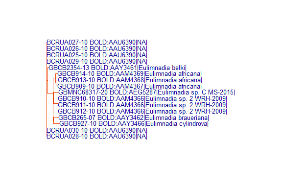
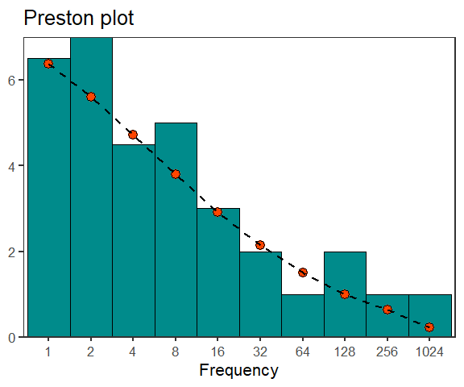
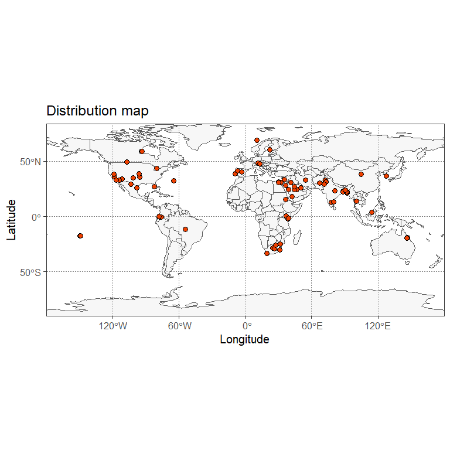
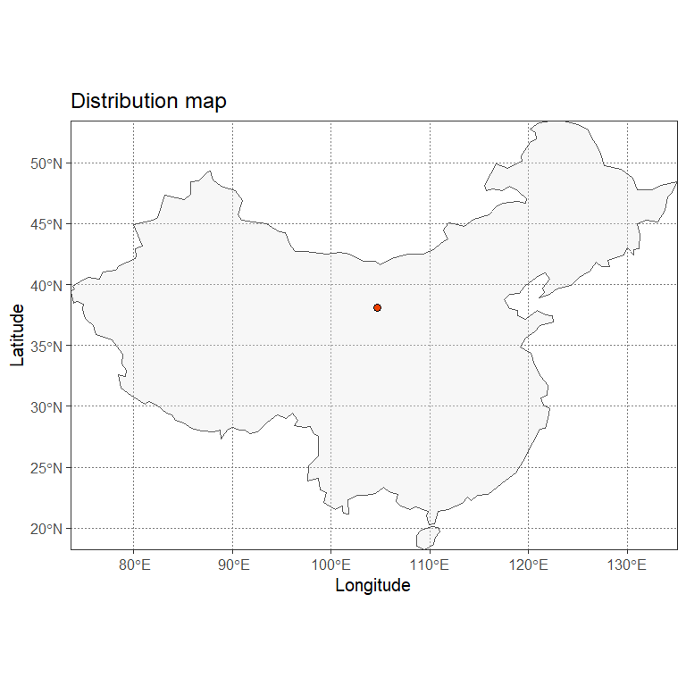

<!-- README.md is generated from README.Rmd. Please edit that file -->

# BOLDconnectR

<!-- badges: start -->
<!-- badges: end -->

BOLDconnectR is a package designed for **retrieval**, **transformation**
and **analysis** of the data available in the *Barcode Of Life Data
Systems (BOLD)* database. This package provides the functionality to
obtain public and private user data available in the database in the
*Barcode Core Data Model (BCDM)* format. Data include information on the
**taxonomy**,**geography**,**collection**,**identification** and **DNA
sequence** of every submission.

## Installation

The package can be installed using `devtools::install_github` function
from the `devtools` package in R (which needs to be installed before
installing BOLDConnectR). *This package currently exists as a private
repo and thus has an authorization token*.

``` r
library(BOLDconnectR)
```

## BOLDconnectR has 9 functions currently:

1.  bold.fields.info
2.  bold.fetch
3.  bold.public.search
4.  bold.data.summarize
5.  *bold.analyze.align*
6.  bold.analyze.tree
7.  bold.analyze.diversity
8.  bold.analyze.map
9.  bold.export

*Function 5 is currently an internal function which requires external
dependencies not included in the package. For their specific usage,
please see the details provided below.*

### Note on API key

The function `bold.fetch` requires an `api key` in order to access and
download all public + private user data. API key can be obtained by
emailing the BOLD support (<support@boldsystems.org>). API key is needed
only for the data retrieval and can be added directly within the
function. Alternatively, it can be set up as an environmental variable
using the ‘Sys.setenv’ function.

``` r
# The key can be added in place of "api.key" 
# Sys.setenv ("api_key"="api.key")
```

It can then be retrieved using `Sys.getenv` function directly or by
storing it as another variable.

``` r
# api.key <- Sys.getenv('api_key')
```

## Functions usage:

### 1.bold.fields.info:

`bold.fields.info` provides all the metadata related to the various
fields (columns) currently available for download from BOLD. The
function gives the name, definition and the data type of each field.

``` r

bold.field.info<-bold.fields.info(print.output = FALSE)

knitr::kable(head(bold.field.info,5))
```

| field     | definition                                                                                              | R_field_types |
|:----------|:--------------------------------------------------------------------------------------------------------|:--------------|
| processid | BOLD System generated unique identifier for the sample being sequenced.                                 | character     |
| sampleid  | User generated identifier for the sample being sequenced, often identical to the Field ID or Museum ID. | character     |
| fieldid   | Specimen or sample identifier generated in the field or lot number for a bulk collection event.         | character     |
| museumid  | Catalog number from a museum collection.                                                                | character     |
| record_id | A BOLD generated identifier for the marker and specimen sequence combination.                           | character     |

### 2.bold.fetch:

This function retrieves public and private user data on BOLD using
the`api key`.The downloaded data can also be filtered using the various
filter arguments available (all `filt` arguments after the `api_key`).
The filtering happens locally after the data is downloaded. Care has to
be taken to select the filters properly. If wrong/too many filters are
applied, it can result in an empty result. The `filt.fields` argument in
the function helps in selecting only the fields needed by the user.

#### *Test data*

Test data is a data frame having 2 columns and 2100 unique ids. First
column has ‘processids’ while second has ‘sampleids’. Either one can be
used to retrieve data from BOLD.

``` r

knitr::kable(head(test.data,5))
```

| processid  | sampleid |
|:-----------|:---------|
| ACAM001-13 | AC13A01  |
| ACAM008-13 | AC13A14  |
| ACAM015-13 | AC13A32  |
| ACAM027-13 | AC13A72  |
| ACAM030-13 | AC13A78  |

#### 2a.Default(all data retrieved)

The arguments provided below need to be specified by default for every
request. Default settings retrieve data for all available fields for
those ids.

``` r

# A small subset of the data used for data retrieval
trial.data=test.data[1:100,]

result<-bold.fetch(param.data = trial.data,
                   query.param = 'processid',
                   param.index = 1,
                   api_key = api.key)

# Results (First 5 rows)
knitr::kable(head(result,5))
```

| processid | record_id        | insdc_acs | sampleid  | specimenid | taxid | short_note | identification_method | museumid | fieldid   | collection_code | processid_minted_date | inst               | specimendetails.verbatim_depository | funding_src | sex | life_stage | reproduction | habitat | collectors | site_code | specimen_linkout | collection_event_id | sampling_protocol | tissue_type | collection_date_start | specimendetails.verbatim_collectiondate | collection_time | collection_date_accuracy | specimendetails.verbatim_collectiondate_precision | associated_taxa | associated_specimens | voucher_type | notes | taxonomy_notes | collection_notes | specimendetails.verbatim_kingdom | specimendetails.verbatim_phylum | specimendetails.verbatim_class | specimendetails.verbatim_order | specimendetails.verbatim_family | specimendetails.verbatim_subfamily | specimendetails.verbatim_tribe | specimendetails.verbatim_genus | specimendetails.verbatim_species | specimendetails.verbatim_subspecies | specimendetails.verbatim_species_reference | specimendetails.verbatim_identifier | geoid | location.verbatim_country | location.verbatim_province | location.verbatim_country_iso_alpha3 | marker_code | kingdom  | phylum   | class          | order        | family    | subfamily           | tribe | genus       | species               | subspecies | identification        | identification_rank | tax_rank.numerical_posit | species_reference | identified_by | specimendetails\_\_identifier.person.email | sequence_run_site  | nuc                                                                                                                                                                                                                                                                                                                                                                                                                                                                                                                                                                                                                                                                                          | nuc_basecount | sequence_upload_date | bin_uri      | bin_created_date | elev | location.verbatim_elev | depth | location.verbatim_depth | lat | lon | location.verbatim_coord | coord_source | coord_accuracy | location.verbatim_gps_accuracy | elev_accuracy | location.verbatim_elev_accuracy | depth_accuracy | location.verbatim_depth_accuracy | realm | biome | ecoregion | region | sector | site | country_iso | country.ocean | province.state | bold_recordset_code_arr                        | geopol_denorm.country_iso3 | collection_date_end |
|:----------|:-----------------|:----------|:----------|-----------:|------:|:-----------|:----------------------|:---------|:----------|:----------------|:----------------------|:-------------------|:------------------------------------|:------------|:----|:-----------|:-------------|:--------|:-----------|:----------|:-----------------|:--------------------|:------------------|:------------|:----------------------|:----------------------------------------|:----------------|:-------------------------|:--------------------------------------------------|:----------------|:---------------------|:-------------|:------|:---------------|:-----------------|:---------------------------------|:--------------------------------|:-------------------------------|:-------------------------------|:--------------------------------|:-----------------------------------|:-------------------------------|:-------------------------------|:---------------------------------|:------------------------------------|:-------------------------------------------|:------------------------------------|------:|:--------------------------|:---------------------------|:-------------------------------------|:------------|:---------|:---------|:---------------|:-------------|:----------|:--------------------|:------|:------------|:----------------------|:-----------|:----------------------|:--------------------|-------------------------:|:------------------|:--------------|:-------------------------------------------|:-------------------|:---------------------------------------------------------------------------------------------------------------------------------------------------------------------------------------------------------------------------------------------------------------------------------------------------------------------------------------------------------------------------------------------------------------------------------------------------------------------------------------------------------------------------------------------------------------------------------------------------------------------------------------------------------------------------------------------|--------------:|:---------------------|:-------------|:-----------------|-----:|:-----------------------|------:|:------------------------|----:|----:|:------------------------|:-------------|---------------:|:-------------------------------|--------------:|:--------------------------------|---------------:|:---------------------------------|:------|:------|:----------|:-------|:-------|:-----|:------------|:--------------|:---------------|:-----------------------------------------------|:---------------------------|:--------------------|
| AJS049-19 | AJS049-19.COI-5P |           | S-02-A-MB |   10597415 | 52768 | NA         | NA                    |          | S-02-A-MB |                 | 2019-08-08            | Chapman University | NA                                  | NA          | NA  | NA         | NA           | NA      |            | NA        | NA               | NA                  | NA                | NA          | NA                    | NA                                      | NA              | NA                       | NA                                                | NA              | NA                   | NA           | NA    | NA             | NA               | NA                               | NA                              | NA                             | NA                             | NA                              | NA                                 | NA                             | NA                             | NA                               | NA                                  | NA                                         | NA                                  |   238 | NA                        | NA                         | NA                                   | COI-5P      | Animalia | Chordata | Actinopterygii | Cichliformes | Cichlidae | Pseudocrenilabrinae | NA    | Oreochromis | Oreochromis niloticus | NA         | Oreochromis niloticus | species             |                       17 | Linnaeus, 1758    | NA            | NA                                         | Chapman University | ATTGTTACAGCRCAYGCTTTCGTAATAATTTTCTTTATAGTAATACCAATWATRATTGGAGGCTTTGGAAACTGACTMRTWCCYCTCATGATYGGTGCMCC                                                                                                                                                                                                                                                                                                                                                                                                                                                                                                                                                                                        |            91 | 2019-08-08           | NA           | NA               |   NA | NA                     |    NA | NA                      |  NA |  NA | NA                      | NA           |             NA | NA                             |            NA | NA                              |             NA | NA                               | NA    | NA    | NA        | NA     | NA     | NA   | US          | United States |                | AJS,DS-OREOSA,DS-OREOSARO                      | USA                        | NA                  |
| AJS084-19 | AJS084-19.COI-5P |           | S-13-C-MB |   10597450 | 52768 | NA         | NA                    |          | S-13-C-MB |                 | 2019-08-08            | Chapman University | NA                                  | NA          | NA  | NA         | NA           | NA      |            | NA        | NA               | NA                  | NA                | NA          | NA                    | NA                                      | NA              | NA                       | NA                                                | NA              | NA                   | NA           | NA    | NA             | NA               | NA                               | NA                              | NA                             | NA                             | NA                              | NA                                 | NA                             | NA                             | NA                               | NA                                  | NA                                         | NA                                  |   238 | NA                        | NA                         | NA                                   | COI-5P      | Animalia | Chordata | Actinopterygii | Cichliformes | Cichlidae | Pseudocrenilabrinae | NA    | Oreochromis | Oreochromis niloticus | NA         | Oreochromis niloticus | species             |                       17 | Linnaeus, 1758    | NA            | NA                                         | Chapman University | CGACGTTGTAAAACGACACYAAGCAYAAAGAYATGGGCACCCTCTATCTAGTATTTGGTGCTTGAGCCGGAATAGTAGGAACTGCACTAAGCCTCCTAATTCGGGCAGAACTAAGCCAGCCCGGCTCTCTTCTCGGAGACGACCAAATCTATAATGTAATTGTTACAGCACATGCTTTCGTAATAATTTTCTTTATAGTAATACCAATTATGATTGGAGGCTTTGGAAACTGACTAGTACCCCTCATGATTGGTGCACCAGACATGGCCTT                                                                                                                                                                                                                                                                                                                                                                                                              |           268 | 2019-08-08           | NA           | NA               |   NA | NA                     |    NA | NA                      |  NA |  NA | NA                      | NA           |             NA | NA                             |            NA | NA                              |             NA | NA                               | NA    | NA    | NA        | NA     | NA     | NA   | US          | United States |                | AJS,DS-OREOSA,DS-OREOSARO                      | USA                        | NA                  |
| AJS019-19 | AJS019-19.COI-5P |           | S-07-A-FB |   10597385 | 52768 | NA         | NA                    |          | S-07-A-FB |                 | 2019-08-08            | Chapman University | NA                                  | NA          | NA  | NA         | NA           | NA      |            | NA        | NA               | NA                  | NA                | NA          | NA                    | NA                                      | NA              | NA                       | NA                                                | NA              | NA                   | NA           | NA    | NA             | NA               | NA                               | NA                              | NA                             | NA                             | NA                              | NA                                 | NA                             | NA                             | NA                               | NA                                  | NA                                         | NA                                  |   238 | NA                        | NA                         | NA                                   | COI-5P      | Animalia | Chordata | Actinopterygii | Cichliformes | Cichlidae | Pseudocrenilabrinae | NA    | Oreochromis | Oreochromis niloticus | NA         | Oreochromis niloticus | species             |                       17 | Linnaeus, 1758    | NA            | NA                                         | Chapman University | —-GGCACCCTCTATCTAGTATTTGGTGCTTGAGCCGGAATAGTAGGAACTGCACTAAGCCTCCTAATTCGGGCAGAACTAAGCCAGCCCGGCTCTCTTCTCGGAGACGACCAAATCTATAATGTAATTGTTACAGCACATGCTTTCGTAATAATTTTCTTTATAGTAATACCAATTATGATTGGAGGCTTTGGAAACTGACTAGTACCCCTCATGATTGGTGCACCAGACATGGCCTTCCCTCGAATAAATAACATGAGCTTTTGACTTCTCCCCCCCTCATTTCTTCTTCTTCTCGCCTCATCTGGAGTCGAAGCAGGTGCCGGCACAGGATGGACTGTTTATCCCCCGCTCGCAGGCAATCTTGCCCACGCTGGACCTTCTGTTGACTTAACCATCTTCTCCCTCCACTTGGCCGGAGTGTCATCTATTTTAGGTGCAATTAATTTTATCACAACCATTATTAACATGAAACCCCCTGCCATCTCCCAATATCAAACACCCCTATTTGTGTGATCCGTCCTAATTACCGCAGTACTACTCCTTCTATCCCTGCCCGTTCTTGCCGCCGGCATCACAATACTTCTAACAGACCGAAACCTAAACACAACCTTCTTTGACCCTGCCGGAGGAGGAGACCCCATCCTATACCAACACTTATTCTGATT— |           665 | 2019-08-08           | BOLD:AAC9904 | 2010-07-15       |   NA | NA                     |    NA | NA                      |  NA |  NA | NA                      | NA           |             NA | NA                             |            NA | NA                              |             NA | NA                               | NA    | NA    | NA        | NA     | NA     | NA   | US          | United States |                | AJS,DS-OREOSA,DS-OREOSARO,DS-TANGQIAN,DS-CICHI | USA                        | NA                  |
| AJS082-19 | AJS082-19.COI-5P |           | S-13-A-MB |   10597448 | 52768 | NA         | NA                    |          | S-13-A-MB |                 | 2019-08-08            | Chapman University | NA                                  | NA          | NA  | NA         | NA           | NA      |            | NA        | NA               | NA                  | NA                | NA          | NA                    | NA                                      | NA              | NA                       | NA                                                | NA              | NA                   | NA           | NA    | NA             | NA               | NA                               | NA                              | NA                             | NA                             | NA                              | NA                                 | NA                             | NA                             | NA                               | NA                                  | NA                                         | NA                                  |   238 | NA                        | NA                         | NA                                   | COI-5P      | Animalia | Chordata | Actinopterygii | Cichliformes | Cichlidae | Pseudocrenilabrinae | NA    | Oreochromis | Oreochromis niloticus | NA         | Oreochromis niloticus | species             |                       17 | Linnaeus, 1758    | NA            | NA                                         | Chapman University | ATGGGCACCCTCTATCTAGTATTTGGTGCTTGAGCCGGAATAGTAGGAACTGCACTAAGCCTCCTAATTCGGGCAGAACTAAGCCAGCCCGGCTCTCTTCTCGGAGACGACCAAATCTATAATGTAATTGTTACAGCACATGCTTTCGTAATAATTTTCTTTATAGTAATACCAATTATGATTGGAGGCTTTGGAAACTGACTAGTACCCCTCATGATTGGTGCACCAGACATGGCCTTYCCCGGCATAAA                                                                                                                                                                                                                                                                                                                                                                                                                                  |           250 | 2019-08-08           | NA           | NA               |   NA | NA                     |    NA | NA                      |  NA |  NA | NA                      | NA           |             NA | NA                             |            NA | NA                              |             NA | NA                               | NA    | NA    | NA        | NA     | NA     | NA   | US          | United States |                | AJS,DS-OREOSA,DS-OREOSARO                      | USA                        | NA                  |
| AJS034-19 | AJS034-19.COI-5P |           | S-12-A-FB |   10597400 | 52768 | NA         | NA                    |          | S-12-A-FB |                 | 2019-08-08            | Chapman University | NA                                  | NA          | NA  | NA         | NA           | NA      |            | NA        | NA               | NA                  | NA                | NA          | NA                    | NA                                      | NA              | NA                       | NA                                                | NA              | NA                   | NA           | NA    | NA             | NA               | NA                               | NA                              | NA                             | NA                             | NA                              | NA                                 | NA                             | NA                             | NA                               | NA                                  | NA                                         | NA                                  |   238 | NA                        | NA                         | NA                                   | COI-5P      | Animalia | Chordata | Actinopterygii | Cichliformes | Cichlidae | Pseudocrenilabrinae | NA    | Oreochromis | Oreochromis niloticus | NA         | Oreochromis niloticus | species             |                       17 | Linnaeus, 1758    | NA            | NA                                         | Chapman University | —-GGCACCCTCTATCTAGTATTTGGTGCTTGAGCCGGAATAGTAGGAACTGCACTAAGCCTCCTAATTCGGGCAGAACTAAGCCAGCCCGGCTCTCTTCTCGGAGACGACCAAATCTATAATGTAATTGTTACAGCACATGCTTTCGTAATAATTTTCTTTATAGTAATACCAATTATGATTGGAGGCTTTGGAAACTGACTAGTACCCCTCATGATTGGTGCACCAGACATGGCCTTCCCTCGAATAAATAACATGAGCTTTTGACTTCTCCCCCCCTCATTTCTTCTTCTTCTCGCCTCATCTGGAGTCGAAGCAGGTGCCGGCACAGGATGGACTGTTTATCCCCCGCTCGCAGGCAATCTTGCCCACGCTGGACCTTCTGTTGACTTAACCATCTTCTCCCTCCACTTGGCCGGAGTGTCATCTATTTTAGGTGCAATTAATTTTATCACAACCATTATTAACATGAAACCCCCTGCCATCTCCCAATATCAAACACCCCTATTTGTGTGATCCGTCCTAATTACCGCAGTACTACTCCTTCTATCCCTGCCCGTTCTTGCCGCCGGCATCACAATACTTCTAACAGACCGAAACCTAAACACAACCTTCTTTGACCCTGCCGGAGGAGGAGACCCCATCCTATACCAACACTTAT———-     |           658 | 2019-08-08           | BOLD:AAC9904 | 2010-07-15       |   NA | NA                     |    NA | NA                      |  NA |  NA | NA                      | NA           |             NA | NA                             |            NA | NA                              |             NA | NA                               | NA    | NA    | NA        | NA     | NA     | NA   | US          | United States |                | AJS,DS-OREOSA,DS-OREOSARO,DS-TANGQIAN,DS-CICHI | USA                        | NA                  |

#### 2b.Institutes Filter

Data is downloaded followed by the ‘institute’ filter applied on it to
fetch only the relevant ‘institute’ (here South African Institute for
Aquatic Biodiversity) data.

``` r

# A small subset of the data used for data retrieval
result_institutes<-bold.fetch(param.data = test.data,
                               query.param = 'processid',
                               param.index = 1,
                               api_key = api.key,
                               filt.institutes = c("Universiti Sains Malaysia","Museum of Southwestern Biology, Division of Parasitology"),
                              filt.fields = c("processid","sampleid","inst","nuc_basecount"))

# Results (first five rows)
knitr::kable(head(result_institutes,5))
```

| processid   | sampleid      | inst                      | nuc_basecount |
|:------------|:--------------|:--------------------------|--------------:|
| BIOPH079-20 | BIOPH_TB51    | Universiti Sains Malaysia |           655 |
| BIOPH084-20 | BIOPH_PS213   | Universiti Sains Malaysia |           655 |
| BIOPH120-20 | BIOPH_USM07   | Universiti Sains Malaysia |           655 |
| BIOPH052-20 | BIOPH_BG31    | Universiti Sains Malaysia |           655 |
| BIOPH024-20 | BIOPH_PS-0088 | Universiti Sains Malaysia |           655 |

#### 2c.Geographic location filter

Data is downloaded followed by the ‘geography’ filter applied on it to
fetch only the relevant locations (here United States) data.

``` r

trial.data=test.data[1:100,]

result_geography<-bold.fetch(param.data = trial.data,
                               query.param = 'processid',
                               param.index = 1,
                               api_key = api.key,
                                filt.geography=c("United States"),
                                filt.fields = c("bin_uri","processid","country.ocean"))
# Result (First 5 rows) 
knitr::kable(head(result_geography,5))                 
```

| processid | sampleid    | bin_uri      | country.ocean |
|:----------|:------------|:-------------|:--------------|
| AJS107-19 | S-03-A-FBC7 | BOLD:AAC9904 | United States |
| AJS005-19 | S-02-B-FB   | NA           | United States |
| AJS049-19 | S-02-A-MB   | NA           | United States |
| AJS035-19 | S-12-B-FB   | NA           | United States |
| AJS083-19 | S-13-B-MB   | NA           | United States |

#### 2d.Altitude

Data is downloaded followed by the ‘Altitude’ filter applied on it to
fetch data only between the range of altitude specified (100 to 1500 m
a.s.l.) data.

``` r

trial.data=test.data[1:100,]

result_altitude<-bold.fetch(param.data = trial.data,
                               query.param = 'processid',
                               param.index = 1,
                               api_key = api.key,
                               filt.altitude = c(100,1500),
                               filt.fields = c("bin_uri","processid","family","elev"))

# Result (First 5 rows)
knitr::kable(head(result_altitude,5))                    
```

| processid  | sampleid | bin_uri      | family    | elev |
|:-----------|:---------|:-------------|:----------|-----:|
| ACAM027-13 | AC13A72  | BOLD:AAA8511 | Cichlidae |  496 |
| ACAM030-13 | AC13A78  | BOLD:AAA8511 | Cichlidae |  286 |
| ACAM001-13 | AC13A01  | BOLD:AAA8511 | Cichlidae |  532 |
| ACAM008-13 | AC13A14  | BOLD:ACE5030 | Cichlidae |  501 |
| ACAM015-13 | AC13A32  | BOLD:AAA8511 | Cichlidae |  526 |

### 3.bold.search.public

This function retrieves the ids (process and sample id) of all publicly
available data based on a search query. NO `api key` is required for
this function. `bold.fetch` can then download all the relevant data for
these ids. This two step process ensures that user has an idea on the
scope of the data (i.e. number of records) based on the ids downloaded.
Search can be based on taxonomic names, geographical locations, BIN ids
(BIN numbers). All the other filters can then be used on the downloaded
data to refine the result further. *The search parameters of this
function should be used carefully. Wrong combination of parameters might
not retrieve any data.*

#### 3a.IDs retrieved based on taxonomy

``` r

result.public.ids<-bold.public.search(taxonomy = c("Panthera leo"))

# Result(First 5 rows)
knitr::kable(head(result.public.ids,5))                    
```

| processid   | sampleid    |
|:------------|:------------|
| ABRMM002-06 | ROM PM13004 |
| ABRMM043-06 | ROM 101200  |
| CAR055-11   | Ple153      |
| CAR055-11   | Ple153      |
| CAR056-11   | Ple185      |

#### 3b.IDs retrieved based on taxonomy and geography

``` r

result.public.geo.id<-bold.public.search(taxonomy = c("Panthera leo"),geography = "India",filt.marker = "COI-5P")

fetch.data.result.geo.id<-bold.fetch(param.data = result.public.geo.id,
                               query.param = 'processid',
                               param.index = 1,
                               api_key = api.key,
                               filt.fields = c("bin_uri","processid","family","elev"))

# Result(First 5 rows)
knitr::kable(head(fetch.data.result.geo.id,5)) 
```

| processid | sampleid | bin_uri | family  | elev |
|:----------|:---------|:--------|:--------|-----:|
| CAR056-11 | Ple185   | NA      | Felidae |   NA |
| CAR056-11 | Ple185   | NA      | Felidae |   NA |

#### 3c.IDs retrieved based on taxonomy, geography and BIN id

``` r
result.public.geo.bin<-bold.public.search(taxonomy = c("Panthera leo"),geography = "India",bins = 'BOLD:AAD6819')

# Result(First 5 rows) 
knitr::kable(head(result.public.geo.bin))                   
```

| processid  | sampleid        |
|:-----------|:----------------|
| GENG056-12 | BIOMTWL-BLE-017 |

#### 4.bold.data.summarize

`bold.data.summarize` provides a detailed profile of the data downloaded
through `bold.fetch`. This profile is further broken by data types
wherein each type of data get some unique measures (Ex.mean,mode for
numeric data). Profile can also be created for specific columns using
the `columns` argument. The function also prints the number of rows and
columns in the console by default.

``` r
to_download=test.data[1:100,]

fetch.data.result.summ<-bold.fetch(param.data = to_download,
                               query.param = 'processid',
                               param.index = 1,
                               api_key = api.key,
                               filt.fields = c("bin_uri","elev","nuc_basecount","species","inst"))

data.summ.res<-bold.data.summarize(fetch.data.result.summ)
#> The total number of rows in the dataset is: 99 
#> The total number of columns in the dataset is: 7

# Result: Data summary (character data)
data.summ.res$character
```

**Variable type: character**

| skim_variable | n_missing | complete_rate | min | max | empty | n_unique | whitespace |
|:--------------|----------:|--------------:|----:|----:|------:|---------:|-----------:|
| processid     |         0 |          1.00 |   9 |  10 |     0 |       99 |          0 |
| sampleid      |         0 |          1.00 |   7 |  12 |     0 |       99 |          0 |
| bin_uri       |        55 |          0.44 |  12 |  12 |     0 |        3 |          0 |
| species       |         0 |          1.00 |  20 |  23 |     0 |        3 |          0 |
| inst          |         0 |          1.00 |  18 |  48 |     0 |        2 |          0 |

#### *5.bold.analyze.align*

This function is currently an internal function of the package (with
documentation). This function acts as a wrapper around the `msa` and
`Biostrings` package functions for users of `BOLDconnectR` by which they
can carry out multiple sequence alignment on the downloaded data by
`bold.fetch` functions. In order to use this function following notation
needs to be used `BOLDconnectR:::align.seq`. In addition, the users need
to install and load `msa` and `Biostrings` separately before using this
function to avoid any errors. A function performs alignment using the
‘ClustalOmega’ algorithm by default, though, more refined alignments can
be done by passing additional arguments of the `msa` function to the
function. The function outputs a modified BOLD BCDM dataset with two
additional columns, one being the aligned sequence and the other being
the name of the sequence as per the user specifications.

``` r

data.4.alignment.ids<-bold.public.search(taxonomy = "Eulimnadia")

aligned.data.result<-bold.fetch(param.data = data.4.alignment.ids,
                               query.param = 'processid',
                               param.index = 1,
                               api_key = api.key,
                               filt.marker = "COI-5P")

data.seq.aligned<-BOLDconnectR:::bold.analyze.align(aligned.data.result)
#> using Gonnet

# Subset of the BCDM data frame of the  aligned sequences and their respective names
 
final.res=subset(data.seq.aligned,select=c(aligned_seq,msa.seq.name))

# Result(First 5 rows)
knitr::kable(head(final.res))
```

| aligned_seq                                                                                                                                                                                                                                                                                                                                                                                                                                                                                                                                                                                                                                                                                                                                                                                                                                                                                                                                                                     | msa.seq.name |
|:--------------------------------------------------------------------------------------------------------------------------------------------------------------------------------------------------------------------------------------------------------------------------------------------------------------------------------------------------------------------------------------------------------------------------------------------------------------------------------------------------------------------------------------------------------------------------------------------------------------------------------------------------------------------------------------------------------------------------------------------------------------------------------------------------------------------------------------------------------------------------------------------------------------------------------------------------------------------------------|:-------------|
| GGGACTCTTTACTTAATTTTTGGTGCTTGATCTGGTATGGTAGGAACAGCCTTAAGCTTGTTAATTCGAGTTGAGTTAGGACAACCTGGCTCTTTTATTGGTGATGACCAGATTTATAATGTGGTAGTTACCGCCCATGCTTTCATCATAATTTTTTTTATGGTTATACCTATCTTGATTGGGGGGTTTGGGAATTGATTGGTCCCTTTAATATTAGGTGCCCCCGACATGGCTTTTCCTCGTTTAAATAATATGAGTTTTTGACTCTTGCCCCCTGCATTGATTTTATTGCTTTCAGGGGCTGGAGTAGAGAGAGGAGCGGGGACTGGTTGAACAGTCTATCCTCCTTTATCGGCCGGAATTGCTCACGCTGGGGCATCTGTTGATTTGAGAATTTTTTCTCTTCATCTAGCCGGGATTTCTTCAATCTTAGGAGCAATTAATTTTATTACCACTATTATTAATATGCGAGTCCAAGGTATAACTTTGGATCGAATTCCTCTCTTTGTGTGAGCGGTTGGAATTACTGCTTTGTTGTTGCTTTTATCTTTACCTGTACTCGCAGGAGCGATTACAATATTATTAACTGATCGTAACCTGAATACTTCTTTCTTTGACCCTGCTGGGGGAGGAGATCCTATTTTATATCAACATTTATTTTGATTTTTTGGCCATCCTGAGGTTTACATTTTAATTTTACCTGGGTTTGGTATGATTTCCCACATTATTAGCCAAGAGAGCGGTAAGAAGGAGTCCTTTGGGACTTTAGGAATGATTTACGCTATACTAGCCATTGGAATCTTAGGATTTGTGGTGTGAGCTCATCATATATTTACAGTTGGTATGGATGTCGATACTCGAGCCTATTTTACCGCAGCAACAATAATTATTGCTGTGCCTACTGGGATCAAGATTTTTAGATGGTTAGGGACTTTACATGGGA | GBCB912-10   |
| –AACTCTTTATTTAATTTTTGGTGCTTGGTCCGGTATAGTAGGAACAGCACTTAGTCTTTTGATTCGAGTAGAATTGGGTCAACCTGGTTCTTTCATTGGAGACGATCAGATTTATAATGTAGTAGTAACTGCTCATGCTTTTATCATGATTTTCTTTATAGTTATACCTATCCTTATTGGAGGGTTTGGAAACTGACTTGTGCCACTAATATTAGGTGCACCTGACATGGCTTTTCCTCGTTTAAATAATATAAGTTTTTGACTTTTACCTCCTGCATTAATCTTATTGTTATCAGGCGCTGGAGTAGAAAGAGGAGCTGGTACAGGATGAACAGTTTATCCCCCTTTGTCGGCTGGGATTGCCCATGCTGGAGCTTCTGTTGATCTGAGAATTTTTTCTCTTCATCTAGCTGGGGTTTCTTCTATTTTAGGGGCTATTAATTTTATTACTACTATTATCAACATGCGAGTTCATGGAATAACTTTAGATCGAATTCCTCTTTTCGTTTGAGCTGTTGGGATTACTGCTTTATTATTACTCTTATCTTTACCTGTTCTTGCCGGAGCTATCACGATGTTACTGACTGATCGTAACTTAAATACTTCTTTTTTTGATCCAGCTGGAGGGGGAGATCCAATTTTGTATCAACATTTATTT——————————————————————————————————————————————————————————————————————————————————————————————-                                                                                                                                                                                              | BCRUA025-10  |
| GGGACTCTTTACTTAATTTTTGGTGCTTGGTCTGGAATAGTTGGGACAGCACTAAGTTTGTTAATTCGAGTGGAGCTAGGGCAACCGGGCTCTTTTATTGGGGACGATCAAATTTATAATGTGGTAGTAACTGCTCACGCTTTCATTATAATTTTCTTTATAGTTATGCCTATTTTGATTGGTGGATTTGGAAATTGGCTTGTGCCTTTGATATTAGGTGCTCCCGATATGGCTTTTCCTCGTTTAAATAATATGAGTTTTTGACTTCTTCCTCCTGCATTAATTTTATTACTCTCAGGAGCCGGAGTTGAAAGAGGGGCAGGAACCGGATGAACAGTATATCCGCCCCTATCAGCTGGGATCGCCCATGCTGGAGCCTCTGTTGACTTGAGAATCTTTTCTCTTCATTTAGCCGGGATTTCTTCAATTTTAGGGGCTATTAATTTTATTACAACCATTATTAATATACGGGTTCAAGGTATAACTTTGGATCGAATTCCTCTGTTCGTATGAGCAGTTGGAATTACAGCTTTATTATTGCTCTTATCTCTACCTGTTCTTGCAGGAGCGATTACTATGTTACTAACTGATCGAAATTTAAACACTTCTTTTTTTGATCCTGCTGGAGGTGGGGACCCAATTTTATATCAACACCTATTTTGATTTTTCGGACACCCTGAAGTTTACATTTTAATTCTACCAGGCTTTGGTATAATTTCTCATATTATTAGCCAAGAAAGAGGTAAGAAGGAGTCTTTTGGTACCCTGGGAATAATTTACGCAATGCTAGCCATCGGGATTTTAGGATTTGTAGTATGGGCCCATCATATGTTTACAGTTGGTATGGATGTGGATACTCGAGCTTACTTTACTGCGGCAACAATGATTATTGCTGTTCCTACTGGAATTAAGATTTTTAGATGATTAGGGACTTTGCATGGAA | GBCB914-10   |
| GGGACTCTTTACTTAATTTTTGGTGCCTGGTCTGGAATAGTTGGAACTGCACTAAGCTTGTTAATTCGAGTGGAGCTAGGGCAACCGGGCTCTTTTATTGGGGATGACCAAATTTATAATGTGGTAGTAACTGCTCACGCTTTTATTATAATTTTTTTTATAGTTATGCCTATTTTGATTGGTGGTTTTGGGAACTGGCTTGTGCCTTTGATATTAGGTGCACCCGATATAGCTTTTCCTCGCTTAAATAATATGAGTTTTTGACTTCTTCCTCCCGCATTAATTTTATTACTTTCAGGAGCCGGAGTTGAAAGAGGGGCAGGAACTGGATGAACAGTATACCCACCTCTATCGGCCGGGATCGCTCACGCCGGAGCCTCTGTTGATTTGAGAATTTTTTCTCTTCATTTAGCTGGGATTTCTTCAATTTTAGGGGCCATTAATTTTATTACAACCATTATTAATATACGGGTTCAAGGTATAACTTTGGATCGAATTCCTCTGTTTGTATGAGCAGTCGGAATTACAGCTTTATTATTGCTCTTATCTCTACCTGTCCTTGCAGGAGCGATTACTATGTTATTAACTGATCGAAATTTAAACACTTCTTTTTTTGACCCTGCTGGAGGGGGAGATCCTATTTTATATCAACATCTATTTTGATTTTTCGGGCACCCTGAAGTTTATATTTTAATTTTGCCAGGCTTTGGTATAATTTCTCATATTATTAGCCAAGAAAGAGGTAAGAAGGAGTCTTTTGGTACCTTAGGAATAATTTATGCAATGCTAGCTATTGGGATTCTAGGATTTGTAGTATGGGCCCACCATATGTTTACAGTTGGTATGGATGTGGATACTCGAGCTTACTTCACTGCGGCAACAATGATTATTGCTGTTCCTACTGGAATTAAGATTTTCAGATGATTAGGGACTTTGCACGGAA | GBCB913-10   |
| GGGACTCTTTACTTAATTTTTGGTGCTTGATCTGGTATGGTTGGAACAGCCTTAAGCTTGTTAATTCGAGTTGAGTTAGGACAACCTGGCTCTTTTATTGGTGATGATCAGATTTATAATGTGGTAGTTACCGCCCATGCTTTCATCATAATTTTTTTTATGGTTATACCTATCTTGATTGGGGGGTTTGGGAATTGATTGGTCCCTTTAATATTAGGTGCCCCCGACATGGCTTTTCCTCGTTTAAATAATATGAGTTTTTGACTCTTGCCCCCTGCATTGATTTTATTGCTTTCAGGGGCTGGAGTAGAGAGAGGAGCGGGGACTGGTTGAACAGTTTATCCTCCTTTATCGGCCGGAATTGCTCACGCTGGGGCATCTGTTGATTTGAGAATTTTTTCTCTTCATCTAGCCGGGATTTCTTCAATCTTAGGAGCAATTAATTTTATTACCACTATTATTAATATGCGAGTCCAAGGTATAACTTTGGATCGAATTCCTCTCTTTGTGTGAGCGGTTGGGATTACTGCTTTGTTGTTGCTTTTATCTTTACCTGTACTCGCAGGAGCGATTACAATATTATTAACTGATCGTAACCTGAATACTTCTTTCTTTGACCCTGCTGGGGGAGGAGATCCTATTTTATATCAACATTTATTTTGATTTTTTGGCCATCCTGAGGTTTACATTTTAATTTTACCTGGGTTTGGTATGATTTCCCACATTATTAGCCAAGAGAGCGGTAAGAAGGAGTCCTTTGGGACTTTAGGAATGATTTACGCTATACTAGCCATTGGAATCTTAGGATTTGTGGTGTGAGCTCATCATATATTTACAGTTGGTATGGATGTCGATACTCGAGCCTATTTTACCGCAGCAACAATAATTATTGCTGTGCCTACTGGGATCAAGATTTTTAGATGGTTAGGGACTTTACATGGGA | GBCB910-10   |
| ————TTGATTTTTGGTGCCTGGTCCGGAATAGTTGGGACAGCATTGAGATTATTAATCCGAGTGGAGCTGGGACAACCTGGCTCTTTCATTGGCGATGATCAGATTTATAACGTAGTGGTTACTGCCCATGCCTTTATTATAATTTTTTTTATGGTCATGCCTATTTTGATTGGTGGATTTGGAAACTGACTCGTACCTTTAATGTTAGGTGCTCCTGACATGGCTTTCCCCCGTTTAAATAATATGAGCTTTTGACTTTTACCTCCTGCATTAATTTTATTGCTTTCGGGAGCTGGTGTTGAAAGAGGGGCAGGAACTGGTTGAACAGTTTACCCTCCTCTGTCAGCTGGTATTGCTCACGCCGGGGCTTCTGTCGATTTGAGCATTTTTTCTCTCCATTTAGCCGGGGTCTCTTCAATTTTAGGGGCTATTAATTTCATTACAACGATTATTAATATACGGGTTCAAGGTATGACTTTGGATCGAATTCCTCTATTTGTTTGAGCTGTGGGAATTACTGCTTTATTACTACTCTTGTCATTACCTGTTCTTGCCGGGGCAATTACAATGCTATTAACTGACCGTAATTTGAATACTTCCTTTTTTGATCCTGCTGGGGGAGGAGACCCTATTTTATATCAACATTTATTTTGATTCTTCGGACATCCCGAGGTTTACATTTTAATTCTGCCAGGGTTTGGTATGATTTCGCATATTATTAGTCAAGAAAGAGGTAAAAAGGAGTCTTTTGGAACTTTAGGGATAATTTATGCTATATTAGCTATTGGAATTCTAGGGTTTGTAGTC——————————————————————————————————————————-                                                                                             | GBCB265-07   |

#### 6.bold.analyze.tree

This function uses the modified BCDM dataframe obtained from the
`bold.analyze.align` to generate a distance matrix, a Neighbor Joining
(NJ) tree visualization and a newick tree output. This function acts as
a wrapper around the `dist.dna` and `plot.phylo` functions from `ape`.
Additional arguments can be passed to the `dist.dna` function using the
`...` argument. Newick trees can be exported optionally.

``` r

data.4.analysis.ids<-bold.public.search(taxonomy = "Eulimnadia")
 
data.4.seqanalysis<-bold.fetch(param.data = data.4.analysis.ids,
                               query.param = 'processid',
                               param.index = 1,
                               api_key = api.key,
                               filt.marker = "COI-5P")

data.seq.align<-BOLDconnectR:::bold.analyze.align(data.4.seqanalysis,seq.name.fields = c("bin_uri","species"))
#> using Gonnet

data.seq.analyze<-bold.analyze.tree(data.seq.align,
                                             dist.model = "K80",
                                             dist.matrix = TRUE,
                                             clus.method="njs",
                                             tree.plot=TRUE,
                                             tree.plot.type = "p")
```



### 7. bold.analyze.diversity

`bold.analyze.diversity` generates a biodiversity profile of the BOLD
BCDM downloaded data using the `bold.fetch` function. Results include,
richness estimations, shannon diversity, preston plots and beta
diversity. Function converts the data into a `site X species` like
matrix (for more information, please scroll till the end) having either
BIN counts (or presence-absence) data at the user-specified taxonomic
level. This function acts as a wrapper function around
`BAT::alpha.accum()`, `vegan::prestondistr()` and `vegan::diversity()`
to calculate the results. Preston plots are created using the data from
the `prestondistr` results where cyan bars represent observed species
(or equivalent taxonomic group) and orange dots for expected the counts.
Beta diversity is based on either the Sørensen or Jaccard indexes. It
also generates matrices of *species replacement* and *richness
difference* components of the total beta diversity. These values are
calculated using `BAT::beta()` function, which partitions the data using
the Podani & Schmera (2011)/Carvalho et al. (2012) approach. *Note that
the results, including species counts, adapt based on taxonomic rank
used in `gen.comm.mat()` although the output label remains ‘species’ in
some instances (preston.res).*

#### 7a. Richness results

``` r
# Fetch the data
BCDMdata<-bold.fetch(param.data = test.data,query.param = "processid",param.index = 1,api_key = api.key)

#1. Analyze richness data
res.rich<-bold.analyze.diversity(BCDMdata,taxon.rank="species",site.cat='country.ocean',richness.res=TRUE)
#>   |                                                                              |                                                                      |   0%  |                                                                              |=                                                                     |   1%  |                                                                              |=                                                                     |   2%  |                                                                              |==                                                                    |   3%  |                                                                              |===                                                                   |   4%  |                                                                              |====                                                                  |   5%  |                                                                              |====                                                                  |   6%  |                                                                              |=====                                                                 |   7%  |                                                                              |======                                                                |   8%  |                                                                              |======                                                                |   9%  |                                                                              |=======                                                               |  10%  |                                                                              |========                                                              |  11%  |                                                                              |========                                                              |  12%  |                                                                              |=========                                                             |  13%  |                                                                              |==========                                                            |  14%  |                                                                              |==========                                                            |  15%  |                                                                              |===========                                                           |  16%  |                                                                              |============                                                          |  17%  |                                                                              |=============                                                         |  18%  |                                                                              |=============                                                         |  19%  |                                                                              |==============                                                        |  20%  |                                                                              |===============                                                       |  21%  |                                                                              |===============                                                       |  22%  |                                                                              |================                                                      |  23%  |                                                                              |=================                                                     |  24%  |                                                                              |==================                                                    |  25%  |                                                                              |==================                                                    |  26%  |                                                                              |===================                                                   |  27%  |                                                                              |====================                                                  |  28%  |                                                                              |====================                                                  |  29%  |                                                                              |=====================                                                 |  30%  |                                                                              |======================                                                |  31%  |                                                                              |======================                                                |  32%  |                                                                              |=======================                                               |  33%  |                                                                              |========================                                              |  34%  |                                                                              |========================                                              |  35%  |                                                                              |=========================                                             |  36%  |                                                                              |==========================                                            |  37%  |                                                                              |===========================                                           |  38%  |                                                                              |===========================                                           |  39%  |                                                                              |============================                                          |  40%  |                                                                              |=============================                                         |  41%  |                                                                              |=============================                                         |  42%  |                                                                              |==============================                                        |  43%  |                                                                              |===============================                                       |  44%  |                                                                              |================================                                      |  45%  |                                                                              |================================                                      |  46%  |                                                                              |=================================                                     |  47%  |                                                                              |==================================                                    |  48%  |                                                                              |==================================                                    |  49%  |                                                                              |===================================                                   |  50%  |                                                                              |====================================                                  |  51%  |                                                                              |====================================                                  |  52%  |                                                                              |=====================================                                 |  53%  |                                                                              |======================================                                |  54%  |                                                                              |======================================                                |  55%  |                                                                              |=======================================                               |  56%  |                                                                              |========================================                              |  57%  |                                                                              |=========================================                             |  58%  |                                                                              |=========================================                             |  59%  |                                                                              |==========================================                            |  60%  |                                                                              |===========================================                           |  61%  |                                                                              |===========================================                           |  62%  |                                                                              |============================================                          |  63%  |                                                                              |=============================================                         |  64%  |                                                                              |==============================================                        |  65%  |                                                                              |==============================================                        |  66%  |                                                                              |===============================================                       |  67%  |                                                                              |================================================                      |  68%  |                                                                              |================================================                      |  69%  |                                                                              |=================================================                     |  70%  |                                                                              |==================================================                    |  71%  |                                                                              |==================================================                    |  72%  |                                                                              |===================================================                   |  73%  |                                                                              |====================================================                  |  74%  |                                                                              |====================================================                  |  75%  |                                                                              |=====================================================                 |  76%  |                                                                              |======================================================                |  77%  |                                                                              |=======================================================               |  78%  |                                                                              |=======================================================               |  79%  |                                                                              |========================================================              |  80%  |                                                                              |=========================================================             |  81%  |                                                                              |=========================================================             |  82%  |                                                                              |==========================================================            |  83%  |                                                                              |===========================================================           |  84%  |                                                                              |============================================================          |  85%  |                                                                              |============================================================          |  86%  |                                                                              |=============================================================         |  87%  |                                                                              |==============================================================        |  88%  |                                                                              |==============================================================        |  89%  |                                                                              |===============================================================       |  90%  |                                                                              |================================================================      |  91%  |                                                                              |================================================================      |  92%  |                                                                              |=================================================================     |  93%  |                                                                              |==================================================================    |  94%  |                                                                              |==================================================================    |  95%  |                                                                              |===================================================================   |  96%  |                                                                              |====================================================================  |  97%  |                                                                              |===================================================================== |  98%  |                                                                              |===================================================================== |  99%  |                                                                              |======================================================================| 100%

# Community matrix (BCDM data converted to community matrix)
knitr::kable(head(res.rich$comm.matrix,5))
```

|            | Oreochromis.andersonii | Oreochromis.angolensis | Oreochromis.aureus | Oreochromis.esculentus | Oreochromis.karongae | Oreochromis.leucostictus | Oreochromis.macrochir | Oreochromis.mortimeri | Oreochromis.mossambicus | Oreochromis.mossambicus.x.Oreochromis.niloticus | Oreochromis.niloticus | Oreochromis.placidus | Oreochromis.schwebischi | Oreochromis.shiranus | Oreochromis.sp. | Oreochromis.sp..1.MV.2022 | Oreochromis.sp..BM4 | Oreochromis.sp..BM6 | Oreochromis.sp..LMN.2018 | Oreochromis.sp..MM14 | Oreochromis.sp..MM3 | Oreochromis.sp..MYS.shop.1 | Oreochromis.sp..SAIAB.86542 | Oreochromis.sp..SAIAB.86900 | Oreochromis.sp..SAIAB.87154 | Oreochromis.sp..SF88 | Oreochromis.sp..SF89 | Oreochromis.sp..TP | Oreochromis.sp..VM5 | Oreochromis.spilurus | Oreochromis.tanganicae | Oreochromis.urolepis | Oreochromis.variabilis |
|:-----------|-----------------------:|-----------------------:|-------------------:|-----------------------:|---------------------:|-------------------------:|----------------------:|----------------------:|------------------------:|------------------------------------------------:|----------------------:|---------------------:|------------------------:|---------------------:|----------------:|--------------------------:|--------------------:|--------------------:|-------------------------:|---------------------:|--------------------:|---------------------------:|----------------------------:|----------------------------:|----------------------------:|---------------------:|---------------------:|-------------------:|--------------------:|---------------------:|-----------------------:|---------------------:|-----------------------:|
| Angola     |                      6 |                      4 |                  0 |                      0 |                    0 |                        0 |                     2 |                     0 |                       0 |                                               0 |                     0 |                    0 |                       0 |                    0 |               3 |                         0 |                   0 |                   0 |                        0 |                    0 |                   0 |                          0 |                           0 |                           0 |                           0 |                    0 |                    0 |                  0 |                   0 |                    0 |                      0 |                    0 |                      0 |
| Australia  |                      0 |                      0 |                  0 |                      0 |                    0 |                        0 |                     0 |                     0 |                       8 |                                               0 |                     0 |                    0 |                       0 |                    0 |               2 |                         0 |                   0 |                   0 |                        0 |                    0 |                   0 |                          0 |                           0 |                           0 |                           0 |                    0 |                    0 |                  1 |                   0 |                    0 |                      0 |                    0 |                      0 |
| Bangladesh |                      0 |                      0 |                  0 |                      0 |                    0 |                        0 |                     0 |                     0 |                       0 |                                               0 |                     1 |                    0 |                       0 |                    0 |               0 |                         0 |                   0 |                   0 |                        0 |                    0 |                   0 |                          0 |                           0 |                           0 |                           0 |                    0 |                    0 |                  0 |                   0 |                    0 |                      0 |                    0 |                      0 |
| Botswana   |                      3 |                      0 |                  0 |                      0 |                    0 |                        0 |                     0 |                     0 |                       1 |                                               0 |                     0 |                    0 |                       0 |                    0 |               0 |                         0 |                   0 |                   0 |                        0 |                    0 |                   0 |                          0 |                           0 |                           0 |                           0 |                    0 |                    0 |                  0 |                   0 |                    0 |                      0 |                    0 |                      0 |
| Brazil     |                      0 |                      0 |                  0 |                      0 |                    0 |                        0 |                     0 |                     0 |                       0 |                                               0 |                    29 |                    0 |                       0 |                    0 |               0 |                         0 |                   0 |                   0 |                        0 |                    0 |                   0 |                          0 |                           0 |                           0 |                           0 |                    0 |                    0 |                  0 |                   0 |                    0 |                      0 |                    6 |                      0 |

``` r

# Richness results (top 10 rows)
knitr::kable(head(res.rich$richness,5))
```

| Sampl |    Ind |  Obs |   S1 |   S2 |   Q1 |   Q2 | Jack1ab | Jack1abP | Jack1in | Jack1inP | Jack2ab | Jack2abP | Jack2in | Jack2inP | Chao1 | Chao1P | Chao2 | Chao2P |
|------:|-------:|-----:|-----:|-----:|-----:|-----:|--------:|---------:|--------:|---------:|--------:|---------:|--------:|---------:|------:|-------:|------:|-------:|
|     1 |  46.71 | 2.89 | 0.81 | 0.36 | 2.89 | 0.00 |    3.70 |     4.54 |    2.89 |     5.78 |    4.15 |     5.34 |    8.67 |    17.34 |  3.43 |   4.36 |  6.65 |  13.30 |
|     2 |  75.21 | 4.54 | 1.33 | 0.50 | 3.74 | 0.80 |    5.87 |     6.87 |    6.41 |    11.10 |    6.70 |     8.00 |    6.41 |    11.10 |  5.44 |   6.47 | 10.05 |  18.32 |
|     3 | 100.46 | 6.07 | 2.01 | 0.53 | 4.57 | 1.04 |    8.08 |     9.55 |    9.12 |    14.72 |    9.56 |    11.47 |   10.47 |    16.98 |  8.00 |   9.76 | 13.13 |  22.27 |
|     4 | 138.38 | 7.43 | 2.53 | 0.62 | 5.37 | 1.13 |    9.96 |    11.60 |   11.46 |    17.93 |   11.87 |    13.97 |   13.77 |    21.69 |  9.91 |  11.77 | 16.60 |  27.23 |
|     5 | 178.84 | 8.65 | 3.01 | 0.68 | 5.98 | 1.23 |   11.66 |    13.60 |   13.43 |    20.33 |   13.99 |    16.48 |   16.47 |    25.08 | 11.85 |  14.12 | 19.89 |  31.58 |

#### 7b. Shannon diversity

``` r
#2. Shannon diversity
res.shannon<-bold.analyze.diversity(BCDMdata,taxon.rank="species",site.cat='country.ocean',shannon.res = TRUE)

# Shannon diversity results (top 10 rows)
knitr::kable(head(res.shannon$Shannon_div,5))
```

|            | Shannon_values |
|:-----------|---------------:|
| Angola     |           1.31 |
| Australia  |           0.76 |
| Bangladesh |           0.00 |
| Botswana   |           0.56 |
| Brazil     |           0.46 |

#### 7c. Preston plot results

``` r

#3. Preston plots and results

pres.res<-bold.analyze.diversity(BCDMdata,taxon.rank="species",site.cat='country.ocean',preston.res=TRUE)

# Preston plot
pres.res$preston.plot
```



``` r

# Preston plot data
pres.res$preston.res
#> 
#> Preston lognormal model
#> Method: maximized likelihood to log2 abundances 
#> No. of species: 33 
#> 
#>      mode     width        S0 
#> -2.289343  4.680817  7.184358 
#> 
#> Frequencies by Octave
#>                 0       1        2        3        4        5        6        7
#> Observed 6.500000 7.00000 4.500000 5.000000 3.000000 2.000000 1.000000 2.000000
#> Fitted   6.374473 5.61248 4.721104 3.794116 2.913104 2.136878 1.497551 1.002679
#>                  8        10
#> Observed 1.0000000 1.0000000
#> Fitted   0.6413874 0.2288613
```

#### 7d. Beta diversity

``` r

#4. beta diversity
beta.res<-bold.analyze.diversity(BCDMdata,taxon.rank="species",site.cat='country.ocean',beta.res=TRUE,beta.index = "jaccard")

# # Total beta diversity matrix (10 rows)
knitr::kable(head(as.matrix(round(beta.res$total.beta,2)),5))
```

|            | Angola | Australia | Bangladesh | Botswana | Brazil | Canada | China | Colombia | Democratic Republic of the Congo | Egypt | Eswatini | Exception - Zoological Park | French Polynesia | Gabon | India | Indonesia | Israel | Italy | Kenya | Liberia | Madagascar | Malawi | Malaysia | Mexico | Morocco | Mozambique | Myanmar | Namibia | Nigeria | Pakistan | Peru | Philippines | Republic of the Congo | Russia | Singapore | South Africa | Sudan | Tanzania | Thailand | Uganda | United Kingdom | United States | Vietnam | Zambia | Zimbabwe |
|:-----------|-------:|----------:|-----------:|---------:|-------:|-------:|------:|---------:|---------------------------------:|------:|---------:|----------------------------:|-----------------:|------:|------:|----------:|-------:|------:|------:|--------:|-----------:|-------:|---------:|-------:|--------:|-----------:|--------:|--------:|--------:|---------:|-----:|------------:|----------------------:|-------:|----------:|-------------:|------:|---------:|---------:|-------:|---------------:|--------------:|--------:|-------:|---------:|
| Angola     |   0.00 |      0.83 |        1.0 |     0.80 |    1.0 |   0.83 |  0.83 |     1.00 |                             1.00 |  1.00 |     0.80 |                           1 |             1.00 |   0.8 |  1.00 |      1.00 |   1.00 |   1.0 |  0.89 |     1.0 |       0.88 |      1 |     1.00 |   1.00 |       1 |       0.92 |     1.0 |    0.67 |    1.00 |     1.00 |    1 |        1.00 |                     1 |      1 |       1.0 |         1.00 |   1.0 |        1 |     1.00 |   1.00 |              1 |          1.00 |     1.0 |   0.71 |     1.00 |
| Australia  |   0.83 |      0.00 |        1.0 |     0.75 |    1.0 |   0.50 |  0.50 |     0.83 |                             1.00 |  0.80 |     0.75 |                           1 |             0.67 |   1.0 |  0.75 |      0.80 |   1.00 |   1.0 |  0.88 |     1.0 |       0.86 |      1 |     0.75 |   0.83 |       1 |       0.80 |     1.0 |    0.83 |    1.00 |     0.75 |    1 |        0.83 |                     1 |      1 |       1.0 |         0.83 |   1.0 |        1 |     0.75 |   1.00 |              1 |          1.00 |     1.0 |   1.00 |     0.75 |
| Bangladesh |   1.00 |      1.00 |        0.0 |     1.00 |    0.5 |   0.67 |  0.67 |     0.75 |                             0.67 |  0.67 |     1.00 |                           1 |             1.00 |   1.0 |  0.50 |      0.67 |   0.67 |   0.0 |  0.83 |     0.0 |       0.80 |      1 |     0.50 |   0.75 |       1 |       0.89 |     0.0 |    0.75 |    0.67 |     1.00 |    1 |        0.75 |                     1 |      1 |       0.0 |         0.75 |   0.0 |        1 |     0.50 |   0.50 |              1 |          0.50 |     0.0 |   0.80 |     1.00 |
| Botswana   |   0.80 |      0.75 |        1.0 |     0.00 |    1.0 |   0.75 |  0.75 |     0.80 |                             1.00 |  0.75 |     0.67 |                           1 |             0.50 |   1.0 |  0.67 |      0.75 |   1.00 |   1.0 |  1.00 |     1.0 |       0.83 |      1 |     0.67 |   0.80 |       1 |       0.90 |     1.0 |    0.50 |    1.00 |     0.67 |    1 |        0.80 |                     1 |      1 |       1.0 |         0.80 |   1.0 |        1 |     0.67 |   1.00 |              1 |          1.00 |     1.0 |   0.83 |     0.67 |
| Brazil     |   1.00 |      1.00 |        0.5 |     1.00 |    0.0 |   0.75 |  0.75 |     0.50 |                             0.75 |  0.75 |     1.00 |                           1 |             1.00 |   1.0 |  0.67 |      0.75 |   0.33 |   0.5 |  0.86 |     0.5 |       0.83 |      1 |     0.67 |   0.50 |       1 |       0.90 |     0.5 |    0.80 |    0.75 |     1.00 |    1 |        0.50 |                     1 |      1 |       0.5 |         0.80 |   0.5 |        1 |     0.67 |   0.67 |              1 |          0.67 |     0.5 |   0.83 |     1.00 |

``` r

#Replacement
#beta.res$replace

#Richness difference
#beta.res$richnessd
```

### 8.bold.analyze.map

``` r
#Download the ids for the data
map.data.ids<-bold.public.search(taxonomy = "Musca domestica")

# Fetch the data using the ids
map.data<-bold.fetch(param.data = map.data.ids,query.param = "processid",param.index = 1,api_key = api.key)

# Visualizing all occurrences
geo.viz<-bold.analyze.map(map.data)
```



``` r

# Visualizing occurrences in a specific country
geo.viz.country<-bold.analyze.map(map.data,country = "China")
```



``` r

#The `sf` dataframe of the downloaded data
# geo.viz$geo.df

# Visualization
# geo.viz$plot
```

### 9.bold.export

`bold.export` provides an export option for some of the sequence based
outputs obtained by functions from *BOLDconnectR*. Sequence information
downloaded using the `bold.fetch` or the aligned sequences obtained
using `bold.analyze.align` can be exported as a fasta file for third
party tool use (`export`=‘fas’ or ‘msa.fas’). Data downloaded by the
`bold.fetch` can be directly used to export the unaligned fasta file
while the modified dataframe obtained after using the
`bold.analyze.align` is needed for exporting the multiple sequence
alignment. Name for individual sequences in the unaligned fasta file
output can be customized by using the fas.seq.name.fields argument. If
more than one field is specified, the name will follow the sequence of
the fields given in the vector. The multiple sequence aligned fasta file
uses the same name given by the user in the bold.analyze.align function.
In addition, the function also allows user edited data (in
taxonomy,geography etc.) to be exported as a csv/tsv file while
retaining its BCDM format. This functionality is added keeping in the
mind the possibility of uploading data to BOLD using the package in the
near future.The edits done to the BCDM data could be from any other R
packages so long as it maintains the BCDM format.

``` r

#Download the ids for the data
# data.for.export.ids<-bold.public.search(taxonomy = "Poecilia reticulata",filt.basecount = c(500,600),filt.marker = "COI-5P")

# Fetch the data using the ids
# data.for.export<-bold.fetch(param.data = data.for.export.ids,query.param = "processid",param.index = 1,api_key = apikey)

# Align the data (using species", bin_uri & country.ocean as a composite name for each sequence)
# seq.align<-BOLDconnectR:::bold.analyze.align(data.for.export, seq.name.fields = c("processid","bin_uri"))

# Export the fasta file (unaligned) (Please note the input data here is the original BCDM data retrieved using bold.fetch)
# bold.export(data.for.export,export = "fas",fas.seq.name.fields = c("species","bin_uri","processid"),export.file.path = "file_path",export.file.name = "file_name")

# Export the multiple sequence alignment (Please note the input data here is the modified BCDM data after using bold.analyze.align)
# bold.export(seq.align,export = "msa.fas",fas.seq.name.fields = ("species","bin_uri","processid"),,export.file.path = "file_path",export.file.name = "file_name")

# Additionally, if the user modifies any content in the BCDM data using any other R function, that modified dataframe can also be exported using bold.fetch. This option has been provided considering a future option of uploading data directly to BOLD
```

## Note on the community matrix generated for `bold.analyze.diversity`

The \*site X species** like matrix generated for
`bold.analyze.diversity` calculates the counts (or abundances) or
presence-absence data of all the records which have BINs for the given
site category (*site.cat*) or a *grid.cat*. These counts can be
generated at any taxonomic hierarchical level for a single or multiple
taxa. *site.cat* can be any of the geography fields (Meta data on fields
can be checked using the `bold.fields.info()`). Alternatively,
`grid.cat` = TRUE will generate grids based on the BIN occurrence data
(latitude, longitude) with the size of the grid determined by the user
(in sq.m.). For grids generation, rows with no latitude and longitude
data are removed (even if a corresponding *site.cat* information is
available) while NULL entries for *site.cat* are allowed if they have a
latitude and longitude value (This is done because grids are drawn based
on the bounding boxes which only use latitude and longitude
values).`grids.cat` converts the Coordinate Reference System (CRS) of
the data to a **Molleweide\*\* projection by which distance based grid
can be appropriately specified. A cell id is also given to each grid
with the smallest number assigned to the lowest latitudinal point in the
data. A basic gridmap is also stored in the output when
`grids.cat`=TRUE. The plot obtained is a visualization of the grid
centroids with their respective names. *Please note that if the data has
many closely located grids, visualization with view.grids can get
confusing*. The argument `presence.absence` converts the counts (or
abundances) to 1 and 0. The community matrix is also stored in the
output as `comm.mat` and can also be used as the input data for
functions from packages like vegan for biodiversity analyses.

#### *BOLDconnectR* is able to fetch public as well as private user data very fast (~100k records in a minute on a fast wired connection) and also offers functionality for data transformation and analysis.
